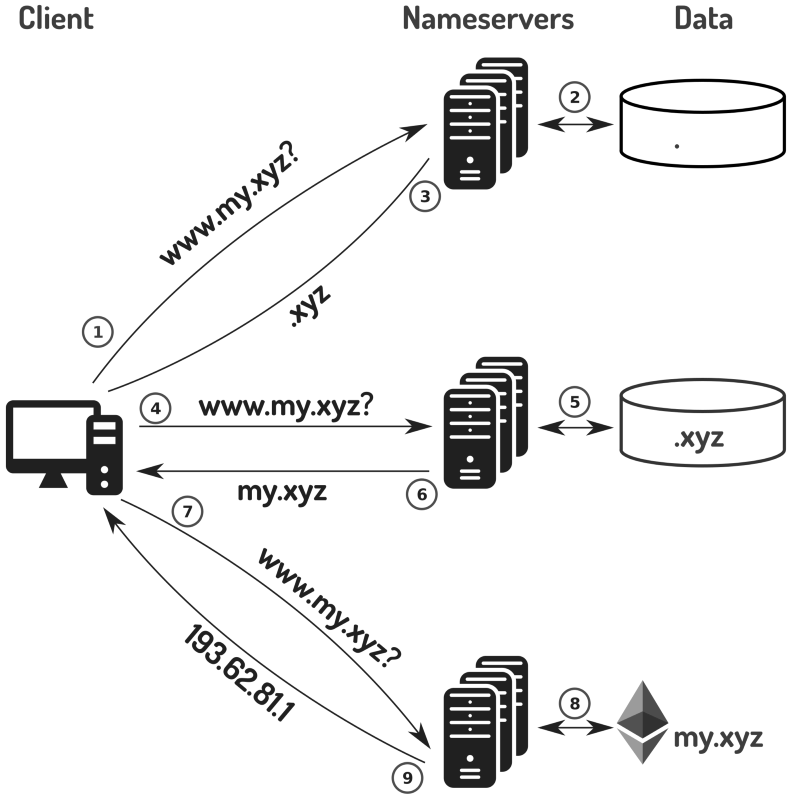

# ENS(Ethereum Name Service)

## 什么是ENS？
EthDNS 由两个部分组成：一个是以太坊域名服务（ENS）解析器，另一个是域名服务器。前者允许在区块链上存储和访问 DNS 信息，后者允许使用与保存在传统域名服务器上的同等 DNS 信息的方式访问 DNS 信息。

这两个部分相结合，将域名解析基础设施图变成了下面的样子：

my.xyz域名的域名服务器已经被配置为从以太坊区块链而非本地存储中获取信息，在图片中以右下角的以太坊符号表示。请注意，域名解析过程与上一张图片记录的过程完全相同，并且客户端不知道信息是从区块链返回的。 这使得 EthDNS 可以替换现有的域名服务器并与现有基础设施无缝配合。

目前（很久以前了）EthDNS 在以太坊的Ropsten测试网络上运行着由ENS支持的域名服务器。例如，如果您访问 http://www.ensdns.xyz ,www.ensDNS.xyz 的IP地址是由 EthDNS 域名服务器解析的。

## 网站
官网        https://ens.domains/
域名管理    https://manager.ens.domains
github     https://github.com/ensdomains

## 合约结构分析

## 域名销售
今年早些时候，以太坊名称服务（ENS）得以成功发布，域名注册数量约为 20 万。目前，域名持有者缺乏将其转售出去的链上方式，而且这已经成为必需的功能。

对 ENS 二手市场的需求的确存在。125 个地址持有一半在 ENS 中注册的域名，且约有 1600 个地址各自持有 10 个以上的域名。这些数字表明现为转售而购买的域名数量十分可观。

域名销售为 ENS 域名持有者提供了一种在公开市场上出售域名的方式。这种方式以智能合约的形式建立，确保双方之间不需要信任。

域名销售是由 ENS 原来的幕后团队成员（Nick Johnson 和 Alex Van de Sande）发展至今的，以确保其正确衔接。

**域名卖家的域名销售过程**
为了提供待售域名，卖家将他们域名的契约所有权转让给域名销售合约。这证明了该卖家拥有上述域名，并允许域名销售合约将该契约传递给最终得主。

一旦所有权被转让给了域名销售合约，该卖家可以同时设置拍卖保留价格和出售购买价格或其中之一。在域名被购买或拍卖开始之前，卖家可以根据自己意愿更改这些价格。

如果某个买家立刻购买域名，那么此次销售立即结束。如果买家出价竞买域名，那么拍卖开始。一旦拍卖结束，买家或卖家可以要求域名销售合约结束此次销售，方式为将契约转让给买家并将资金（较少的介绍费）转让给卖家。

介绍费在域名销售过程中扮演着一个很重要的角色。介绍费的目的在于保证域名销售尽可能得到广泛采用，方式为鼓励钱包、网站和其他工具的开发人员提供域名销售，以从利益中分得一杯羹作为回报。无论是直接购买还是通过拍卖，一个域名销售额的 10% 属于介绍人：其中 5% 属于挂牌出售的介绍人，剩余 5% 属于提供中标价格的介绍人。这确保买卖双方都拥有足够大的市场，从而以最好的价格获得最佳范围的域名。

请注意，卖家要想在不向域名销售合约提供相关资金的前提下购买域名的话，那是不可能的。这确保了当你出售域名时，你可以在无需对卖家信赖的情况下放心地相信资金会交付给你。

同时注意，卖家可以在拍卖开始前的任何时候取消域名的销售。这样的话，相关契约的所有权会返回给卖家，而且撤销该域名的拍卖。

出售过程以下面图表的形式展示：
  
-卖家的域名销售过程。卖家实施的拍卖用方括号括出。其它实体实施的拍卖用尖括号括出。-

总结：卖家可以列出他们希望通过立即购买或拍卖形式出售的 ENS 域名，使此类域名的信息为广泛受众所知，并且在无需依赖第三方的情况下在无需信任的系统中获得所述域名的最佳价格。

**域名买家的域名销售过程**
当买家希望购买可通过直接购买获得的域名，他们支付所要求的金额，然后域名就会转让给他们。

当买家希望购买可通过拍卖获得的域名，他们从起拍价开始投标。一次出价之后的24小时倒计时内可以接收其他出价。每次额外的出价后重新设置倒计时，避免“阻击”问题：投标在一次拍卖结束前的最后几秒内进行，不给其他竞标者反应的机会。为了防止不相干的投标，每个新投标价格必须至少比上一个高出 10%。为了防止无止尽的拍卖，7天后，前述新投标价格必须至少比上一个高出 50%。

请注意，在卖家将待出售的域名移交给域名销售合约之前，卖家无法提供该域名。这保证了你在竞标或购买域名时能够放心地认为域名可以交付到你手上而不需要对域名主人的信任。

该过程以下面的图表形式展现：

-买家的域名销售过程。买家进行的拍卖用方括号括出。其它实体进行的拍卖用尖括号括出。-

总结：买家可以浏览待出售的ENS域名，并立即投标或购买，以及获得他们想要的域名，这一切都在一个无需信任的系统中进行，不依赖于第三方。

**利用域名销售**
人们希望域名销售被大量普通以太坊工具和网站所利用。域名销售支持的更多细节可以在我们接下来的通告中获得

**和域名销售协作**
域名销售是一种智能合约，设计目的在于使第三方工具可以轻松地提供有关域名销售的信息，以及购售域名。

购售域名的功能设计得尽可能方便使用。所有投标都是公开的，避免了投标后需要予以透露的问题，让竞标者看到他们希望获得的域名的实时状态。

域名销售的完整活动历史可以从其事件日志中获得。这让任何外部应用能够获得待出售的域名的最近情况以及这些域名的任何投标。

域名销售合约的开发人员文档可以从 http://domainsale.readthedocs.io/ 获得。

如果你对用来列出、购买或出售域名的构建工具感兴趣，请访问 DomainSale gitter，我们很乐意在此为你提供帮助。

