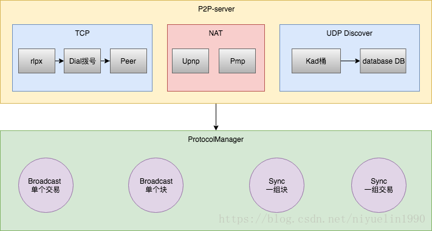
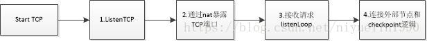

# 1. 架构
笔者一直致力于区块链底层技术研究。本文将讲下以太坊geth源码P2P的启动过程和源码结构。 
 
P2P启动位于p2p模块server.go, 初始化的工作放在Start()方法中。

# 1 启动server
P2P启动主要包括两个部分启动TCP和启动UDP，默认端口30303。 
UDP：udp主要用于p2p节点发现，包括nat地址转换，discover发现模块。 
TCP：tcp主要用于节点和节点连接的区块链数据的处理, 包括接收其他节点的连接和主动连接其他节点的功能，主要逻辑在Peer，同时通过Nat向外暴露地址。

## 
P2P网络数据处理流程

监听(ListenLoop)+拨号(Dial) –> 建立连接(SetupConn) –> Enc 握手(doEncHandshake) –> 协议握手(doProtoHandshake) –> 添加Peer Addpeer –> Run Peer


# 2. 启动UDP
udp启动：

```go
//启动discover网络。 开启UDP的监听。
    if !srv.NoDiscovery { 

        ntab, err := discover.ListenUDP(srv.PrivateKey, srv.ListenAddr, srv.NAT, srv.NodeDatabase, srv.NetRestrict)
        if err != nil {
            return err
        }
        //设置最开始的启动节点。当找不到其他的节点的时候。 那么就连接这些启动节点。
        if err := ntab.SetFallbackNodes(srv.BootstrapNodes); err != nil {
            return err
        }
        srv.ntab = ntab
    }
//新的节点发现协议,试验阶段未使用
    if srv.DiscoveryV5 {
        ntab, err := discv5.ListenUDP(srv.PrivateKey, srv.DiscoveryV5Addr, srv.NAT, "", srv.NetRestrict) //srv.NodeDatabase)
        if err != nil {
            return err
        }
        if err := ntab.SetFallbackNodes(srv.BootstrapNodesV5); err != nil {
            return err
        }
        srv.DiscV5 = ntab
    }
```
启动流程如下： 


## 2.1开启UDP端口
```go
    conn, err := net.ListenUDP("udp", addr)
```
## 2.2通过nat暴露Udp端口
将服务开启的Udp端口注册(map)到Nat网络，这样内网的程序有了外网的IP地址， 这样公网的用户就可以直接对你进行访问。

```go
if !realaddr.IP.IsLoopback() {
            go nat.Map(natm, udp.closing, "udp", realaddr.Port, realaddr.Port, "ethereum discovery")
        }
```

Nat:nat代表网络地址转换。以太坊主要有upnp和pmp两种nat网络协议。 
upnp:采用goupnp实现，地址：github.com/huin/goupnp 
pmp:采用go-nat-pmp实现，地址:github.com/jackpal/go-nat-pmp

## 2.3 网络数据读取和处理
网络数据读取和处理主要包括协议，节点发现和节点存储3个部分。 
1. 协议：网络数据包包括4种数据包协议，分别是ping,pong,findnode和neighbors。    
    findnode 是用来查询距离target比较近的节点   
    neighbors回应数据包
 
2. 节点发现：网络发现协议使用了Kademlia 协议。主要逻辑在discover/table.go   
    Kademlia: Kad 是一种分布式哈希表（ DHT） 技术， 不过和其他 DHT 实现技术比较，如 
    Chord、 CAN、 Pastry 等， Kad 通过独特的以异或算法（ XOR）为距离度量基础，建立了一种 
    全新的 DHT 拓扑结构，相比于其他算法，大大提高了路由查询速度。

3. 节点存储：发现节点的存储主要使用leveldb。 主要逻辑在discover/database.go

# 3.启动TCP
```go
// listen/dial
    if srv.ListenAddr != "" {
        if err := srv.startListening(); err != nil {
            return err
        }
    }
    if srv.NoDial && srv.ListenAddr == "" {
        log.Warn("P2P server will be useless, neither dialing nor listening")
    }

    srv.loopWG.Add(1)
    //主动发起连接来连接外部节点的流程和已经连接的checkpoint逻辑
    go srv.run(dialer)
```
启动流程如下： 


## 3.1开启Tcp端口
```go
    listener, err := net.Listen("tcp", srv.ListenAddr)
```
## 3.2通过nat暴露Tcp端口
```go
go func() {
            nat.Map(srv.NAT, srv.quit, "tcp", laddr.Port, laddr.Port, "ethereum p2p")
            srv.loopWG.Done()
        }()
```

## 3.3 节点和节点数据的处理
节点和节点数据处理主要启动2个goroutine, srv.listenLoop(), srv.run(dialer)。 
listenLoop:接收外部的请求 
run:主动发起连接来连接外部节点的流程以及处理checkpoint队列信息的流程

TCP数据解析采用Rlpx协议，Tcp节点挑选和连接的处理主要在dial，节点之间的数据逻辑主要在peer。

1. rlpx:RLPx协议就定义了TCP链接过程的的加密过程。主要逻辑在rlpx.go 
RLPX:Perfect Forward Secrecy, 链接的两方生成生成随机的私钥，通过随机的私钥得到公钥。 然后双方交换各自的公钥， 这样双方都可以通过自己随机的私钥和对方的公钥来生成一个同样的共享密钥(shared-secret)。后续的通讯使用这个共享密钥作为对称加密算法的密钥。 这样来说。如果有一天一方的私钥被泄露，也只会影响泄露之后的消息的安全性， 对于之前的通讯是安全的(因为通讯的密钥是随机生成的，用完后就消失了)。

2. dial:p2p里面主要负责建立链接的部分工作。 比如发现建立链接的节点。 与节点建立链接。 通过discover来查找指定节点的地址等功能。 主要逻辑在dial.go

3. peer:peer代表了一条创建好的网络链路。在一条链路上可能运行着多个协议。比如以太坊的协议(eth)。 Swarm的协议。 或者是Whisper的协议。 geth主要采用的是以太坊的协议。主要逻辑在peer.go
