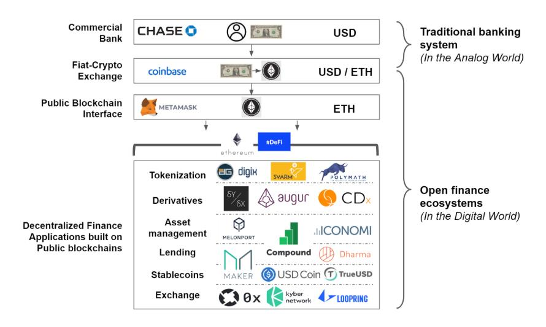

# 现有生态

# 稳定币
- DAI

# 交易所
- 0x
- DDEX
- Loopring
- uniswap

# 支付
- 比特币 闪电网络
- 以太坊 雷电网络 Raiden Network

# 借贷
- Compound
- Dharma

# 其他
- dYdX 衍生品
- Abacus 资产代币化
- Found Protocol 基金管理
- Set Protocol
- Gnosis