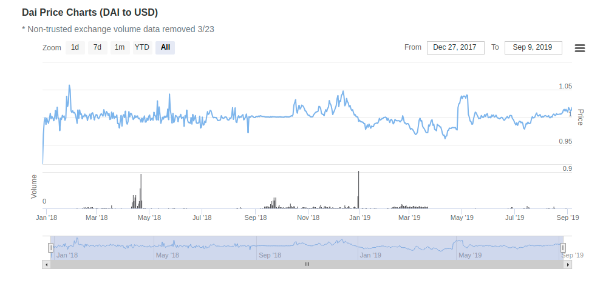
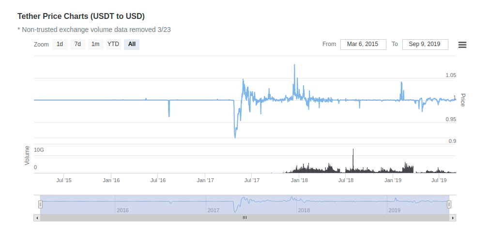
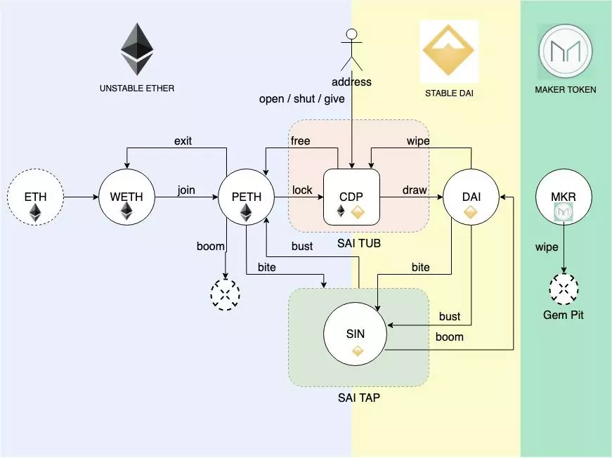
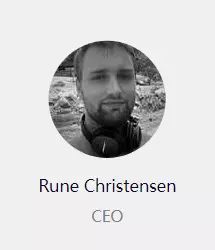
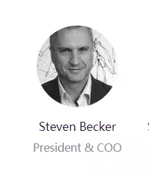

# MakerDAO解析

## Dai 稳定货币系统概述

诸如比特币和以太币这样的热门数字资产，由于其巨大的波动性而无法被当做日常的货币使用。比特币的价值经常经历很大的波动，单日价格变化可达25%，有时一个月增长超过300%。市场需要一种价值稳定的数字货币作为交易媒介.
Dai 稳定货币是由抵押资产支撑的数字货币，其价格和美元保持稳定。Maker 是以太坊上的智能合约平台，通过抵押债仓（CDP）、自动化反馈机制和适当的外部激励手段支撑并稳定 Dai 的价格。Maker 平台可以让任何人有机会利用以太坊资产生成 DAI 进行杠杆操作。当 Dai 被创造出来后，它可以作为任何其它数字货币资产一样使用：自由发送给他人，作为商品和服务的支付手段，或者长期储藏。重要的是，Dai 的出现也是健全的去中心化杠杆交易平台的必需品。

## 架构

## DAI的历史波动情况
以下是截止2019年9月10日, DAI的历史价格波动, 数据来源: https://openmarketcap.com/cryptocurrency/dai-usd

与USDT做对比

相比USDT, DAI的波动性较大, 但总体还是可以稳定在 $1 的水平上.

## 实现
Maker DAO 系统是由多个智能合约（Sai Tap、Sai Tub、Vox、Medianiser 等）和 ERC-20 通证组成. 它们一起来确保 DAI 通证的稳定性。

## Maker DAO 项目团队浅析

MakerDAO项目是Rune Christensen在2015年发起。2016年，团队推出了OasisDEX去中心化交易所，2017年稳定币DAI正式在以太坊上线。

到目前为止，MakerDAO团队拥有约50人左右。其中有一部分技术开发者来自Bitshares。这给Dai项目打下了扎实的基础。

Rune Christensen是来自丹麦的创业者，Maker DAO项目的创始人。  
Maker DAO 是一个基于以太坊(Ethereum)技术的，价值稳定的去中心化加密数字货币项目。在创立 Maker 项目之前，Rune Christensen在北京管理一家人力资源服务机构超过四年时间，并且深度参与了 BitShares 社区，Maker 和 DAI(贷券) 的设计灵感就是来自 BitUSD 项目。在 Maker，Rune Christensen的主要工作是设计了 Dai 债券系统的底层经济机制，并积极参与系统制度设定，以及两个 Maker 的最主要的资产，稳定的去中心化债券(DAI)和去信任的股权代币(MKR)的市场推广工作。

Andy Milenius,前亚马逊工程师。目前是DappHub和Maker DAO的核心工程师，去中心化应用开发专家。Maker DAO是以太坊上的去中心化自治组织和智能合约系统，为市场提供以太坊上第一个去中心稳定货币Dai。Dai是由数字资产抵押背书的硬通货，与美元保持1:1锚定。

Steven Becker毕业于开普敦大学。毕业之后，Steven Becker一直在金融领域工作，先后在保险、投资银行、证券借贷、基金等公司工作过。多年的从业经验，让Steven Becker对金融市场有非常深刻的认识。

2018年4月，Steven Becker加入Maker DAO并出任公司COO。

## 融资情况

2017年12月16日，Maker DAO团队获得了安德森·霍洛维茨基金和 Polychain Capital 领投 1200 万美金的 MKR 代币，其他投资方包括 Distributed Capital Partners, Scanate, FBG Capital, Wyre Capital, Walden Bridge Capital。

安德森·霍洛维茨基金是硅谷顶尖的风投公司之一。从2013年起，安德森·霍洛维茨基金开始积极进入加密货币领域，被视为最早投资加密项目的机构基金。

Maker DAO团队将把基金用于拓展开发资源、支持长期市场进入战略以及丰富关系网络。

另外，硅谷知名风投 A16Z  (Andreessen Horowitz) Crypto 以 1500万美金增持 6% MKR。

A16Z Crypto 是 A16Z 2018年6月设立一支规模为 3 亿美元的加密货币投资基金，专注于区块链领域内的企业、代币和技术协议等方面的投资。

这次投资让 A16Z 成为去中心化稳定币项目 MakerDAO 的重要治理方之一。A16Z 旗下团队将提供 MakerDAO 项目三年的资本运作、商业网络、市场人事和运营支持，以及 Dai 的监管合规与大规模采用。

## 合作机构

下表列举了Maker DAO的部分合作机构。从目前的合作机构来看，Maker DAO将推出多种资产抵押产品，包括电子黄金、OMG通证等。同时项目方将来也会考虑将某些国家的债券作为多种担保资产DAI的抵押物。

Tradeshift2018年7月6日Tradeshift致力于让供应链与通证市场、支付和应用连接起来。目前估值11亿美元，服务用户超过15家公司。为投资者创造新的基于实物资产的投资方式，同时为中小企业利用应收款项和其他甲乙创造新的融资方式，提供流通性。

Request Network2018年5月4日Request Network是一个分布式的网络，能够让人们在任何地方发起支付请求。其应用场景包括：在线支付、开发票、审计与会计等等。DAI嵌入基于Request Network的去中心化金融应用，作为支付工具提供金融稳定性。

Dether2018年4月18日Dether致力于构建一个由支持数字通证支付的商店、数字通证买家、卖家的生态系统。作为支付方式之一，推动商家支持数字通证支付。

OmiseGo2018年4月10日OmiseGo（OMG）是以太坊上的去中心化网络，能够实现跨境、跨资产类别的金融服务。DAI能够作为OMG网络中的基础通证进行交易。

PayBear2018年2月23日PayBear是一种为商家提供多种数字通证支付的服务商。DAI的稳定性特征能够鼓励PayBear平台上的商户接受DAI支付并持有。

CargoX2018年2月22日CargoX是一个去中心化的平台，利用区块链的智能合约技术来实现快速、安全、可靠的供应链生态系统。DAI将被用于供应链生态系统的多个环节，为企业提供金融基础设施。同时也会在智能合约安全性上进行合作。

Digix2018年1月31日Digix能够实现将实物黄金转化为数字黄金。DGX是Digix上以黄金为锚定的通证。加入Digix Gold（电子黄金）作为DAI的抵押担保物。

## 资料

[1] MakerDAO白皮书 https://makerdao.com/whitepaper/Dai-Whitepaper-Dec17-zh.pdf