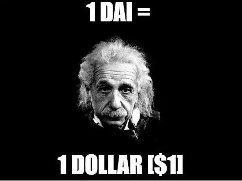
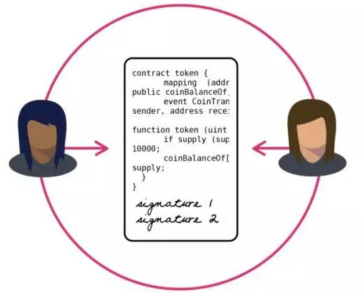
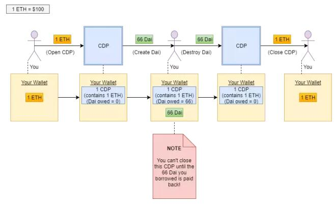

# 让大众读懂 Maker : DAI 稳定币的通俗解释
## 划重点
1 Dai = 1美元
Maker利用抵押及价格反馈制度使Dai稳定在1美元。其中，抵押品由MKR持有人以及一系列智能合约共同谨慎管理。
MKR持有人充当最后买家 (buyer of last resort)
智能合约是区块链的神奇解决方案
Maker 使用利率机制（通过智能合约实现）使Dai稳定于1美元
全球结算提供最后一层安全保障
你需要稳定币来充分发挥区块链技术的潜力
Maker还提供去中心化的杠杆交易功能

当有人被问及Maker项目时，最常见的回答是：“呃，看起来很酷，但是太复杂了，我没弄懂”。我将以让5岁小孩也能看懂（explain it like I’m five）的简化方式来介绍Maker的工作原理。如果你希望了解更多的细节、技术上的解释，我推荐你阅读Maker的紫皮书。

## Maker 的产品是什么？

本文不是聚焦于Maker是什么，而是主要介绍Maker组织的第一个产品。这个产品叫Dai。
Dai是一种稳定币。稳定币的概念直截明了：它是一种存在于区块链中的代币（类似比特币和以太币）。但不同于比特币或者以太币，它没有波动。
“有什么东西是没有波动的，只不过波动是相对的！”
对，你说的很对。Dai对标的稳定资产就是美元。因此，总而言之，1 Dai等于1美元。Dai 将成为第一个实用的消费级稳定币。

## 难道现在没有稳定币吗？你撒谎！
 
现在有稳定币，但又不是真正的稳定币。你最熟悉的可能是某种通过把美元存储在银行账户，并在区块链上发行的由美元“支撑”的稳定币。我把这种币称为“法币”，或者“IOU币”。因为如果这些银行账户一旦被冻结或者会计师欺诈了代币持有者，那么最终从银行能够提现的稳定币就变成了真正的欠条(IOU)。依赖于法律制度来维持加密代币稳定，实际上是将不可信赖的中间方带入了区块链。
DAI 在这方面可以做得更好。
Maker 的 Dai 是一种完全存在于区块链上，并且其稳定性不需要法律体系或信任方提供中介。

## 等等，你先告诉我，我为什么需要稳定币？

稳定币有助于我们充分实现区块链技术的愿景。所有要求价格波动平缓的区块链应用，比如消费者贷款，不可能以每天波动10-20％的货币（比如比特币和以太币）计价。如果你使用比特币将汇款从一个国家转到另一个国家，那么很有可能在一个区块确认周期（即区块链包含你的交易所需要的时间）内的价格变动将大于西联汇款或Paypal所收取的手续费。如果你在Augur上打赌总统选举的结果，并且要在六个月甚至更久以后才能知晓结果，那么相信你也不会想用以太币来衡量这个赌注。最重要的是，稳定币允许去中心化交易所（该交易所无须可信赖的中间方，用户始终保持对自有资金的充分保管）用美元而非比特币或以太币来衡量交易对。这将使得普通人更容易进行加密代币交易，并有效避免诸如门头沟（Mt.Gox）和Bitfinex等遭受的黑客攻击。

## 那么Maker系统如何运作呢？
 
这将是本教程中最具挑战性的部分。要理解Maker如何保持Dai代币的稳定性，你需要掌握一些关于区块链，尤其是以太坊的背景知识。我会在你可能不了解的某些词语旁边加上简要的定义。如果你已经掌握这些预备知识了，那就太棒了，你一定会爱上Maker系统的优雅。那我们就开始吧：
注意：如果你只是一位消费者，你可能不需要理解下面的内容，除非你很好奇。如果你只是想购买Dai，你可以用美元、韩元、比特币、以太币或者其它货币在各类交易所中买到。
Dai（Maker系统内的稳定币）由抵押品（具体来说，就是以太币）支撑。假设你持有以太币，并且你想要生成Dai。首先你需要把你的以太坊发送到一个我们称之为“担保债务头寸（collateralized debt position，以下简称CDP）”的地方。 CDP是一个运行在区块链上的软件——在本例中，即以太坊区块链——并且存在于Maker生态系统中。这个软件我们称之为智能合约，但不要过度追究这个名字。

## 停，我没跟上！
如果你已经理解上述一切，那么请跳过这一部分。如果你觉得自己还有些困惑，那我们就把它拆分、类比讲解。

## Maker 生态系统的基础是什么？
 
整个Maker生态系统都是建立在像CDP这样的“智能合约”上面的，即上述所提的智能合约。区块链能让您点对点完成一些通常需要中间商的事情。就像互联网让你无须中间人便可分享信息一样，区块链让你在没有中间人的情况下分享价值。比特币是第一个使用这个概念的网络，其核心前提是，你可以从点A发送比特币到点B而无需信任中间人。区块链承载着这份信任，因为它不会被任何人控制。以太坊进一步发展了这一概念，并允许用户在这些传输中添加指令。智能合约由此诞生。现在你可以说：“某月某日，某时某分，把我的特别指示和以太币从点A发送到点B吧。”

## 那么，Maker如何使用智能合约来创建稳定币呢？

Maker的核心智能合约是CDP，我们用一个类比来描述。假设你在银行请求房屋贷款。你把你的房子作为抵押品，银行把现金给你作为贷款。如果你房子的价值下降了，他们会要求你偿还贷款。如果你不能偿还贷款，他们就会把你的房子收走。对于 Maker 来说, 以太就相当于房子，智能合约相当于银行，Dai 相当于贷款。你把以太存入 CDP 智能合约，然后你就获得 Dai 贷款。如果你抵押的以太币的价值低于某一个阈值，那么你要么像偿还银行贷款一样偿还智能合约的贷款，要么智能合约把你的以太币收走并拍卖给竞价最高者。

总而言之，CDP就是Maker系统中负责保管抵押品（以太币）的地方。
 
一旦你的以太币发送给了CDP智能合约，你就可以创造出Dai。你所创造的Dai数量取决于你在CDP中投入的以太币价值。这个比例是固定的，但可以随时间变化。抵押的以太价值和所能创造的DAI的价值比率，我们称之为抵押率。
 
假设以太币现在价值100美元，且抵押率为150％。如果我把1个以太币（100美元）发送到CDP智能合约，那么我现在就可以创造66个Dai。这意味着，在以太币的当前价值下，我每创造100个Dai都有1.5个以太币作为抵押。在Maker系统中，你不会失去你的以太币，但你也不再有权控制它。你发给CDP的以太币会被一直锁在那里，直到你还清66个Dai（这一个过程将销毁偿还的Dai）。下图有助于你以可视化的方式了解你该如何激活与关闭CDP。尝试跟着图中“你的钱包（Your Wallet）”的操作流程走一遍。这个图进行了简化。例如，CDP并不存在你的钱包里；图中也对系统更高级应用所需的几个步骤进行了删减，但是这些其实与你作为Dai借款方无关。

## Dai的稳定性怎么样呢？

如果以太币的价格不会波动，我们肯定能保证Dai的稳定性（如果真是这样的话，我们就不需要Dai了）。但是以太币的价格会变化，所以我们需要考虑这一点。
顺便说一句，如果你只是想学习怎样使用这个系统，看到这里就够了。
如果以太坊的价值下跌会造成什么影响？
 
我们没有必要解释以太币上涨时会发生什么事情。系统抵押率会更高，Dai 价值会变得更高。这并不是说Dai 价值不能变得太高——尤其是人们对Dai的需求比创造Dai的意愿更高时。但是如果Dai的交易价格超过一美元，那么Maker就会有对应的机制去激励用户创造更多的Dai（详情请参读下文：目标利率反馈机制）。但是，如果以太币的价值下降，那么问题就来了。如果作为抵押品的以太币的价值不足以支撑相应数量的Dai，那么Dai的价值就会低于一美元，系统有可能崩溃。Maker会通过清算CDP并在以太币价值不足以支撑Dai之前拍卖以太币来解决这个问题。基本上，如果CDP中的价格反馈显示以太币的价值已经低于一定的阈值（假设为所创造的Dai代币价值的125％），那么CDP会被“清算”，并且CDP中的以太币会被拍卖，直到从CDP借出的Dai被还清。让我们回到图表来看看这个过程是如何运作的。和以前一样，为了便于理解，我简化了一些步骤，系统中还有一些附加功能可以防止各种边缘攻击。

明白了吗？非常简单。如果你不及时偿还CDP借给你的Dai，那么系统就会清算你的抵押品。这种方式确保Dai有足够的抵押品支撑。

## 规避黑天鹅 - 什么是MKR代币？

如果你在考虑这个系统的缺陷，那么你不难发现“黑天鹅事件”出现的可能性。假设以太币价格在短时间内迅速崩盘并跌破100%的抵押率，那么系统可能根本没有时间应对。幸运的是，Maker为这种情况提供了解决方案：MKR (makercoin)。 MKR是一种以太坊区块链上的代币（和Maker生态系统的其他部分一样），具有Maker智能合约的管理权限。比方说，上述例子中所使用的CDP的抵押率是由MKR的持有者投票决定的。作为管理系统的回报，MKR持有者将获得费用收入。然而，作为MKR持有者也是有风险的。他们将充当最终买家。如果系统中的抵押品不足以支撑现存的数额，那么MKR就会被创造并出售到公开市场上，以筹集所需的抵押品。这为MKR持有者提供了一个强有力的激励机制，使得他们可以负责任地规范CDP创造Dai的参数。因为如果系统失败，他们将最终遭受损失，与此同时 Dai 的持有者不会有这个风险。我可以写更多关于MKR的机制和角色的介绍，但这是另外一个主题。

## 与美元保持一致：目标比率反馈机制是什么？

到目前为止，我已经谈到了Maker制度的基本稳定性，但是我们还没有谈到为了保持1Dai等于1美元而采取的激励措施。这项措施，我们称之为目标利率反馈机制（TRFM）。说实话，这东西比较复杂。不过最重要的是以下几点：当Dai的交易价格超过1美元时，智能合约会激励人们生成Dai。当Dai的交易价格不到1美元时，智能合约会激励人们赎返Dai。这个过程就类似于央行通过利率来控制货币供应量。您可以阅读白皮书以获取有关系统如何实际运作的更多详细信息。

## 最终保护—什么是全球结算？

三年来，尽管有区块链领域最优秀的开发人员不断地开发，经历了严格的字节码水平审计，并且在测试网上已经运行面向开发人员为中心的稳定币（Sai）数月，我们深知一个完美的系统是很难一次实现的。为了尽可能保证系统的安全性，并预防不可预见的情况，Maker团队添加了一个“全球结算”的功能。一旦全球结算被触发，整个系统将被冻结，Dai和CDP的所有持有者将被归还基础抵押品。因此，如果全球结算被触发，且当时我拥有100个Dai，一个以太币的价值是100美元，那么我可以通过智能合约直接将100个Dai兑换成一个以太币。 CDP内的抵押品也依次返回给借款方。全球结算可以由一组持有全球结算密钥的可信人员触发。如果这些人员发现可怕的错误，他们将使用他们的钥匙来启动这个过程，得体地结束系统。

“但这不是让这个......中心化了？！”

不，并不会。全球结算的唯一结果就是返还你的抵押品。它不会盗取你的以太币或Dai，或者代替你与系统进行互动。全球结算最不济的情况是你最终不得不自己面对抵押品的波动直到系统恢复，或者你可以把抵押品放到交易所。

## 额外功能：去中心化杠杆
 
聪明的人，也许会注意到 Dai 币创造过程中的一个有趣的结果。价格波动不能被消灭，它只能转移。如果我们有 Dai 这样的稳定币，那么它的波动性到底去哪里了呢？在 Maker 体系中，波动性转移给 了 CDP 的持有者。用我们之前的例子，如果我从某个抵押有一个以太币的CDP中借出66个Dai，只有当以太币价值高于清算比例时，我才能拥有那个以太币。Dai其实是我抵押以太币后所获得的贷款。
 
这意味着：我可以把我借的Dai用来买更多的以太币。通过这样做，我基本上是杠杆购买以太币。没错，完全去中心化的杠杆。当你在整合了Maker的去中心化交易所进行交易时，你可以用比你实际拥有的2x，3x甚至更多的资金来做多以太坊。

## 结论

我把 Maker Dai 稳定币称为第一个实用的消费级稳定币，因为它将从过去的系统和竞争对手中脱颖而出，成为众多应用中第一个将区块链技术带给大众的应用。