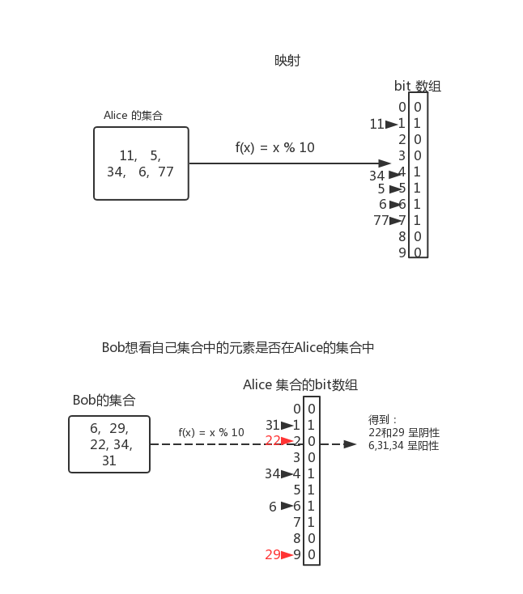
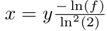
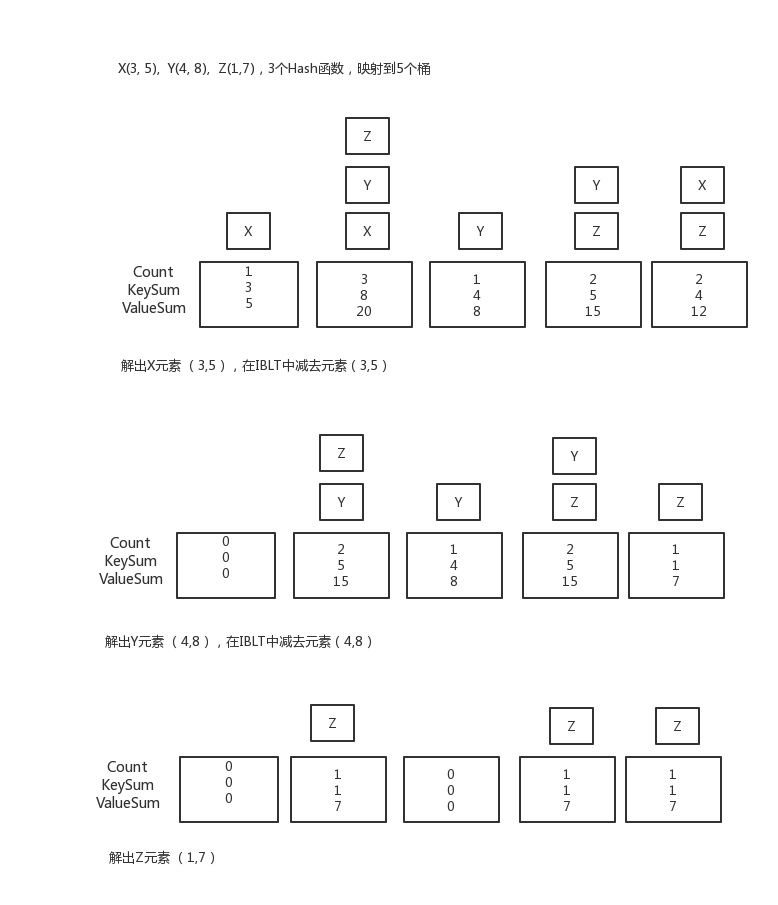
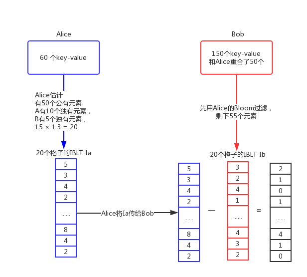
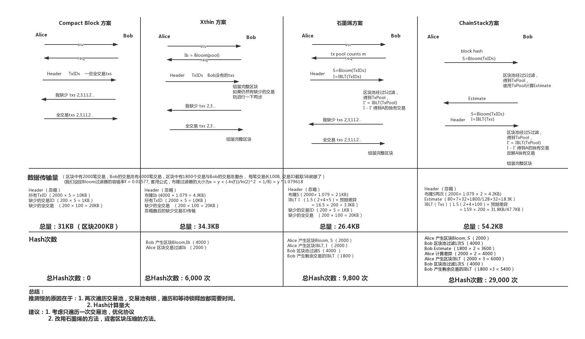
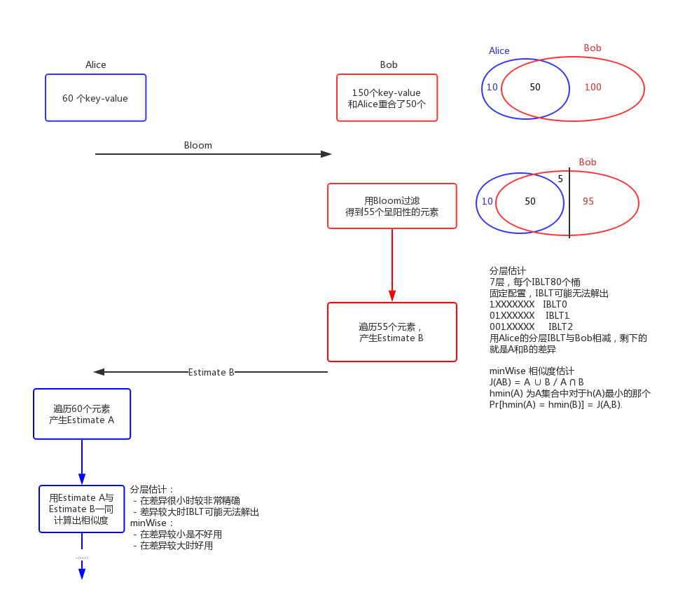
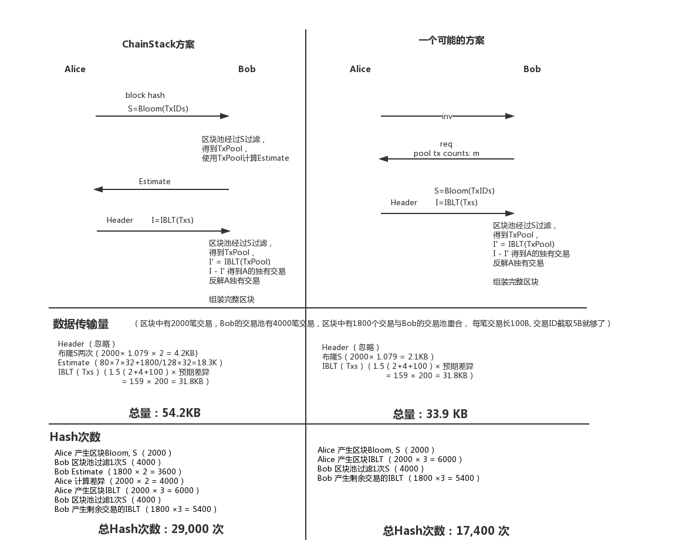
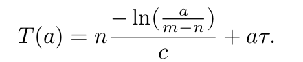

## 简单理解布隆过滤器


布隆过滤器的原理也是一样的，只是f(x)是K个Hash函数，得到的bit数组就是Bloom过滤器。
- 22 和 29 呈阴性，那么这两个元素一定不在Alice的集合中
- 6, 34, 31呈阳性，只能说这几个元素可能在Alice的集合中，其中31呈阳性但不在Alice中，这种情况叫做假阳性。

假阳性率和所使用的函数以及Bit数组的大小有关，如果函数用f(x) = x, Bit数组长达100bit,那么不存在假阳性，即假阳性率为0%。

对同一个集合，产生大的Bloom过滤器，假阳性率较小。小的Bloom过滤器，假阳性较大。用x bits的布隆过滤器来代表y个元素。要求假阳性率为f,那么x的值为：



## 简单理解可逆布隆过滤器（IBLT）
可逆布隆过滤器相对于布隆过滤器，不采用Bit数组来存，而采用桶来存。

将n个key-value对存入IBLT中，IBLT的桶的结构包含三个字段：
- count: Map到这个格子的元素个数
- keySum: Map到这个格子的元素的Key的和
- valueSum: Map到这个格子的元素的Value的和

IBLT使用k个随机hash函数，h1,h2,...,hk. 一个（x,y)的键值对存入桶T[h1(x)], T[h2(x)], ... T[ht(x)]中。那么m个格子的表可以分成k个子表，每个子表有m/k个元素。每个Hash函数从子表中选取一个格。

```
Insert(x,y)
    for each (distinct) hi(x), for i = 1, . . . , k do
        add 1 to T[hi(x)].count
        add x to T[hi(x)].keySum
        add y to T[hi(x)].valueSum
    end for
```
反解元素




根据GoodRich教授在他的论文中的结论， __在K＝4的时候，IBLT的效果是最好的，且插入M个元素，应有大于1.3M个桶。即N >= 1.3*M, K = 4__

## 为什么可逆布隆过滤器能减少传输的数据量？


如果Alice
- 直接传输60个key-value过去，则数据量为：60 × (KeySize + ValueSize)
- 如果通过IBLT传输，则数据量为： 20 × （KeySize + ValueSize + CountSize）

因此， __需要IBLT的桶的数量S是和AB之间的差异成正相关的，Da为Alice的独有元素，Db为Bob的独有元素,c为常数。即： S >= c*(Da + Db)__ 

## IBLT的用法
[大图](./pic/cp.pdf)


ChainStack方案的优点：
减少了一个来回的数据传输

ChainStack方案中值得思考改进的地方：
- 关于同一个区块，Alice要为不同的传输对象生成不同的IBLT，即 __IBLT的计算是per request的__，非常耗时。
- 我们 __用IBLT传输交易__，因为交易的长度是不同的，IBLT中的数据必须是定长的。于是我们对交易进行了切分，切分过程增加了很多的Hash量。石墨烯只传输交易ID,而交易ID是定长的，因此不存在这个问题。
- 为了计算区块池和区块的差异，引入了Estimate. __Estimate的引入__，在以上例子中增加了18.3K的数据传输量(占总量的30%)，以及7600次Hash（占总量的26%）. 这种表现不如直接传5个字节的交易ID片段。

## IBLT Estimate 是做什么的？
Estimate的过程就是估算(Da + Db)的过程。以此来确定IBLT桶的个数。



## 如果我们删掉Estimate, 采用石墨烯的做法方法，方案能有多少提升？


## 为什么石墨烯在传IBLT时不需要Estimate？
Alice收到Bob的request消息，这个消息里带有Bob的交易池中的交易数量。Alice，算出布隆过滤器，和IBLT一同传输给Bob。这个过程中Alice只是知道了Bob交易池的大小，并没有做Estimate就生成了IBLT。为什么不需要Estimate呢？

他们假设两者的差异是很小的，甚至是0.然后给出了传输量的计算公式，并计算最小值。



## 我们的改进方案
方案一: 

    1. 先将区块传播方式改成直接传播区块
    2. 做实验,选出最好的方案
    3. 实现方案到ChainStack上
    
    
方案二:

    1. 先将区块传播方式改成直接传播区块
    2. 提升交易广播算法,进行交易池同步
    3. 采用迭代的方式,首先实现CB方案(1-2周),进一步实现石墨烯方案

<!-- ## 如果我们删掉Estimate, 采用石墨烯的做法方法，方案能有多少提升？


## 建议
1. 区块传播的优化可以放在
 ## 可能的改进  -->