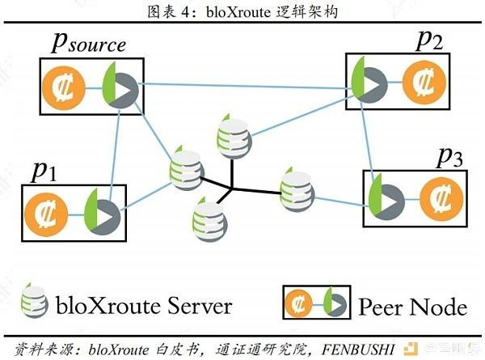
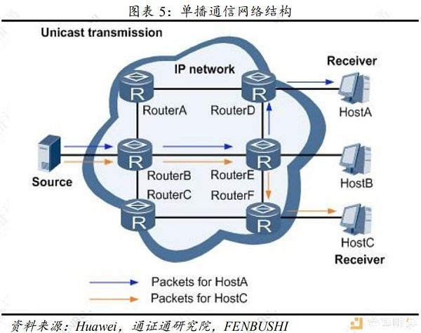
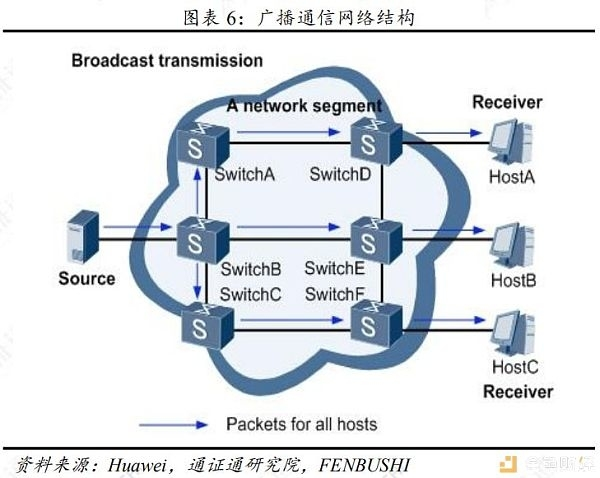
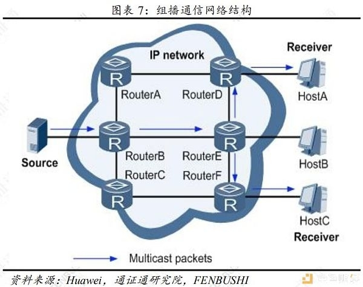
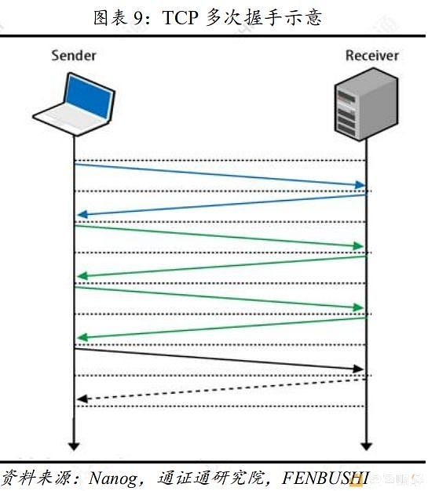
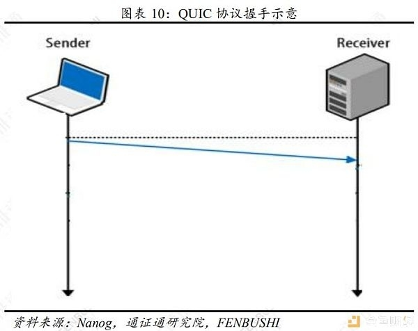

# 传输优化
BCD bloXroute
组播　Nexus
QUIC Harmony区块链项目
除了以上几个项目，第0层扩容项目还有致力于增强乃至取代现有网络基础设施Marconi和Toda Network等，但最终能否落地均具有较高的不确定性。
背压（BackPressure）路由算法

## BDN
**BDN（Blockchain Distribution Network，区块链分发网络）是一种基于CDN技术思路的区块链扩容应用，即一种能够快速发送交易和区块的高容量、低延迟网络系统。**由于BDN遵循无差别对待区块，公平传播区块链的原则，其具有可验证的网络中立性。目前，采用BDN的典型项目为bloXroute。**bloXroute是一个基于BDN 和P2P网络，无需更改协议，允许所有通证在链上扩展到每秒数千个事务的区块链可扩展性解决方案。**该项目最初在2018年1月，由美国西北大学和康奈尔大学学者组成的BloXroute Labs发起，团队中有两位创始人是 Falcon的发起人。目前BloXroute由Metastable、Fenbushi Capital、Flybridge、1confirmation、Maven11 Capital、Kilowatt Capital、Pantera Capital、zk Capital、ZhenFund、Coinbase Ventures、FBG Capital等机构和一些私人赞助商投资，未来预期将发行BLXR作为该网络的通证。 bloXroute能够消除扩大区块的不利影响，降低孤块率，提升区块在点对点网络中的传播效率和网络传播的公平性，在保证非中心化和安全性的基础上显著提升链上可扩展性。节点（Peer Node）运行网关进程作为区块链应用程序和BDN之间的媒介。节点会对BDN网络行为进行审查，确保该网络无法为特定节点或矿工提供更优质的服务或歧视特定节点，任何节点都能通过该网络发送或接收区块，以实现网络传播的公平性。这种特点可称为可证明的中立性，其优势能够促使更多节点加入该BDN网络，在BDN 网络高效性的作用下，各节点间区块传播速度将逐渐提升。

## 组播锁定组：单点发送、多点接收

目前，**网络通信有三种基本模式：单播、广播和组播**。其中，相较于传统的单播和广播的通信模式，组播出现的时间最晚，但其优势显著，具有最佳的发展前景。

**单播通信指信息源向每个需要信息的用户均发送独立数据包的通信方式。**这意味着在单播通信的网络中，信息源会将多份内容相同的数据包同时发送给不同用户，传输的信息量与信息需求的用户量成正比。这种通信方式会对信息源和网络带宽造成较大压力，容易引起网络拥堵，不利于数据批量发送，仅适用于用户数量稀少的网络环境。

**广播通信指无论用户是否需要该信息，信息源向该网段中所有用户发送同一数据包的通信方式。**在采用广播通信的网络中，无需信息的用户也将被动接收该信息，易造成同一网段信息泛滥，也不利于保障信息安全。由此可见，该通信方式无法与特定用户进行数据交互，因而产生大量带宽浪费。

**组播通信指允许一个或多个信息源对不同用户同时发送单一数据包的通信方式。**组播通信有效解决了单播和广播无法解决的“单点发送、多点接收”问题，提升网络传播效率。相比于单播通信方式而言，在组播通信的网络中，信息源尽可能将数据包在距其最远的节点进行复制分发，以避免由用户增加导致信息源负载过重的情况，从而大幅度减少了网络资源的消耗。相比于广播通信方式而言，组播通信方式只将数据包传输给需要该数据的用户，因而能够避免浪费网络资源，且有效保障了信息传输的安全性。

目前，**Nexus**是组播技术在区块链上实际应用的一个项目。Nexus采用了一种优化的路由系统，即组播锁定组。IP组播处理的是网络层上的包复制，而不是应用层上的包复制，这大大加快了传播时间。在锁定组中运行IP组播的另一个好处是在网络层形成并行性，这意味着消息被广播到相关节点，同时能够保留全局一致层。

## QUIC协议：整合TCP和UDP协议

**TCP（Transmission Control Protocol，传输控制协议）是一种面向连接的、可靠的、基于字节流的传输层通信协议，能够实现数据通信的完整性和可靠性，但存在网络延迟问题。**从技术原理看，TCP协议在创建连接前需进行三次握手，如若需要实现更高级别的数据安全交互，则需增加握手次数，但与此同时网络延迟也将加重。由于TCP使用校验和、确认和超时重传机制保证可靠传输，对数据分节进行排序，使用累积确认以保证数据顺序不变和非重复，该协议能提供数据的可靠递送或故障的可靠通知。

**UDP（User Datagram Protocol，用户数据报协议）是除TCP协议外，基于OSI模型的另一重要传输层协议。**UDP是一个简单的、面向无连接的、不可靠的传输层通信协议。信息源在发出UDP数据包后，默认该数据包已被接收，因而网络传输层无需对数据包的传达进行确认。由于UDP只提供不可靠的数据传送，**该协议无法确保数据传输的完整性，但避免了数据重传导致的时间延迟问题。**它仅适用于对传送时间要求较高，但无需可靠数据传输或能在程序中执行错误检查和纠正的应用，例如流媒体、实时多人游戏和IP语音等应用程序。**QUIC（Quick UDP Internet Connections，快速UDP互联网连接）协议是一种由Google提出的基于UDP协议进行多路并发传输的新一代网络传输协议。QUIC协议旨在整合TCP协议的可靠性和UDP协议的高效性。**在技术层面上，该协议可以在1至2个数据包（数量取决于连接的服务器是否已知）内完成连接。自2014年起，Google Chrome开始实验性地支持QUIC协议。Google意在使用QUIC协议取代TCP协议以加快网页传输速度，使其成为新一代网络正式规范。**QUIC协议在Harmony区块链项目的扩容方案中有所应用。Harmony是一个针对分布式金融设计的高吞吐量、低延迟、低费用的高性能共识平台。**该项目通过跨层对区块链的可扩展性进行创新优化。在协议层，Harmony采用了基于分片的共识协议，该协议随着网络节点的增加而扩展。每个分片包含了数百个节点，采用快速BFT算法在几秒内达成共识。在网络层，Harmony依赖于QUIC协议尽可能快地传输消息并提高消息传递的可靠性。在系统层，Harmony研究了UniKernel（通过使用专门的库操作系统来构建的单地址空间机器镜像）以进一步扩展操作系统上单个节点的性能。

## 参考
[1] 通证通研究院（ ID:TokenRoll ） https://www.feixiaohao.com/news/4080982
