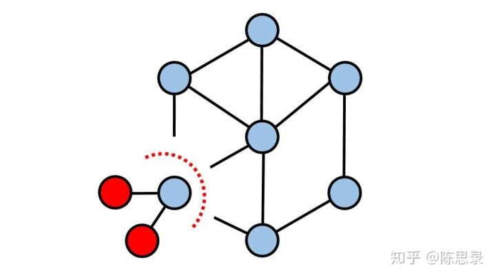
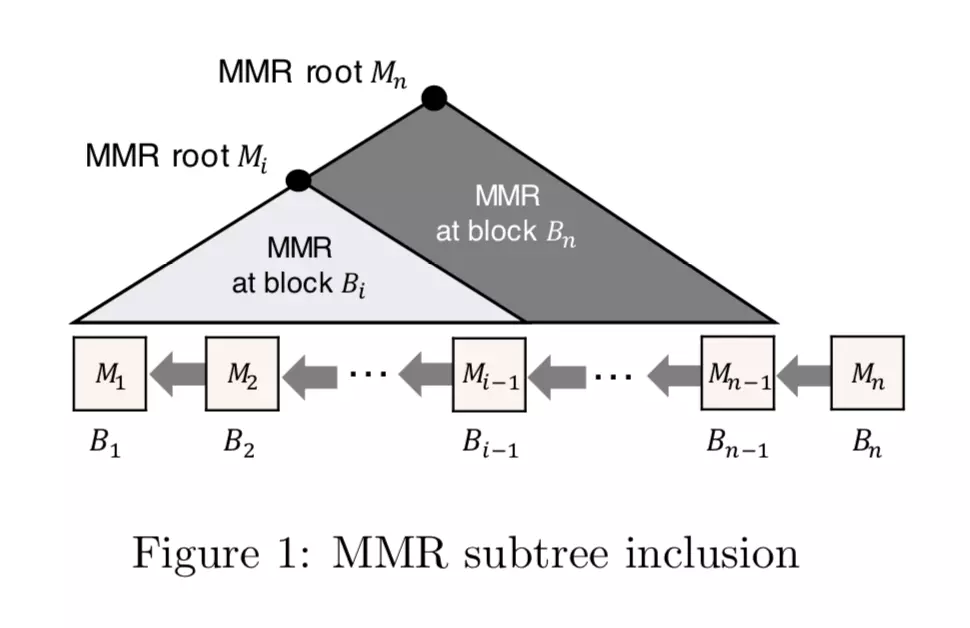
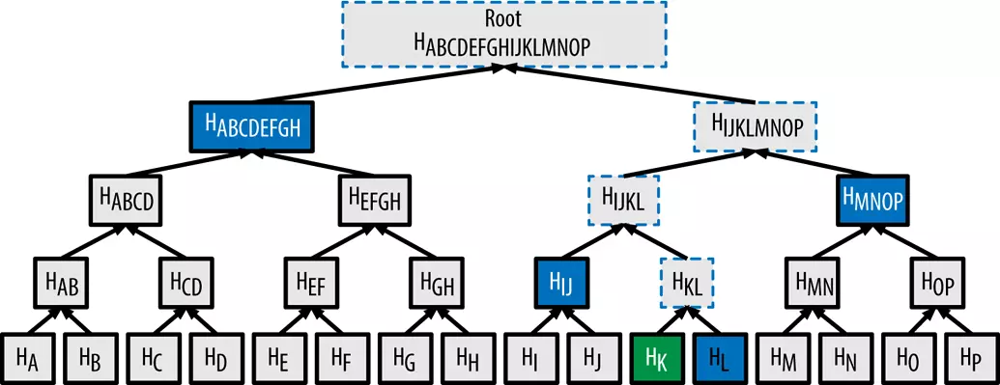

# 超轻节点技术分析

## 超轻节点的定义

超轻节点技术起源于轻节点技术, 轻节点又称为 SPV 节点. SPV 是“Simplified Payment Verification”（简单支付验证）的缩写。中本聪论文简要地提及了这一概念，指出：不运行完全节点也可验证支付，用户只需要保存所有的 block header 就可以了。用户虽然不能自己验证交易，但如果能够从区块链的某处找到相符的交易，他就可以知道网络已经认可了这笔交易，而且得到了网络的多少个确认。按照中本聪的原文，这里有个细节需要注意，SPV 指的是“支付验证“，而不是“交易验证”。这两种验证有很大区别。"交易验证”非常复杂，涉及到验证是否有足够余额可供支出、是否存在双花、脚本能否通过等等，通常由运行完全节点的矿工来完成。“支付验证”则比较简单，只判断用于“支付”的那笔交易是否已经被验证过，并得到了多少的算力保护（多少确认数）。

然而, 虽然下载全部区块头比下载完整区块消耗的带宽和硬盘空间大大减小, 像 Bitcoin 目前下载全部的区块头只需要几十兆, 但是如以太坊由于出块间隔更短，区块体积更大， 全部区块头大约有 4GB，SPV 客户端也不算轻。于是就有相应的超轻节点技术。在这些超轻节点中，要验证某个区块的存在性，节点不需要保存任何数据，而只需要向网络中保持联系的一些全节点索取若干证明并进行验证即可。

## 超轻节点技术的意义

SPV 技术最开始被用于低性能终端的支付验证，可以大大缩减节点部署的成本。超轻节点则更进一步，让手机、浏览器插件都可轻松运行节点。举个具体运用的例子，有一个用户想用自己创建一个区块链节点来进行 DApp 的开发，但是又不想参与共识，其实对于这个用户来说，同步大量的数据是一件很耗时的事情，并且十分浪费相关的硬盘资源，部署 SPV 节点可以轻松在服务器上运行，使用超轻节点技术甚至可以让页面直接验证交易。

另一个运用的方向在于分片、侧链和跨链技术。绝大多数分片、侧链和跨链技术都需要传递不同分片（链）的状态，同时运行几个分片（链）的成本太高并不现实，超轻节点是一个相对综合的解决方案。对于分片技术来说，当存在大量分片时，哪怕运行的是SPV节点也会需要大量的储存空间，超轻节点则完全不需要保存数据。

## 超轻技术类型

首先，我们需要明确支付证明的内容：

1. 证明本链为最长合法链;
2. 证明目标区块在最长合法链上;
3. 证明交易在目标区块里;

超轻节点的工作流程如下：

1. 从几个全节点获取此阶段（支付证明的内容）的证明；
2. 验证证明，选取更高可信度的节点或要求更多证明；
3. 完成此阶段验证，进行下一阶段验证；

超轻节点目前技术可分为两类：

1. NIPoPoW（非交互式的工作量证明的证明）
   NIPoPoW（非交互式的工作量证明的证明）提供了一个高效的区块存在性证明方法，并根据此方法创造了一种叫做超轻节点的协议。在这种超轻节点中，要验证某个区块的存在性，节点不需要保存任何数据，而只需要向网络中保持联系的一些全节点索取若干个叫做 NIPoPoW 的证明。NIPoPoW 是很难伪造的，轻节点在索取到的这几个证明中比较，选择其中最可信的一个，并进行对该证明有效性的验证。与我们之前提到的在移动客户端上通过连接全节点进行交易验证所不同的是，移动客户端是完全信任他们连接的全节点的，如果该全节点欺骗了客户端，则客户端无法分辨自己被欺骗了。在 NIPoPoW 协议中，全节点发送的是一套难以伪造的证明。这个证明与当前区块链长度是 log 多项式的关系，非常简短，使得节点可以在资源受限的移动客户端内对这个证明进行验证。在这里，对正确性的验证不是基于对所连接的全节点的信任，而是基于其协议背后的数学原理。
2. FlyClient
   FlyClient 方案，同样只要求下载对数数量的区块头来同步和验证交易，同时在执行之间只存储一个区块头。目前，研究人员已正式证明了 FlyClient 的有效性，对于以太坊，这种协议可把验证证明数据压缩到 500 KB 左右。这是通过使用一种名为 MMR（Merkle Mountain Range）承诺的简单设计，以及一个概率区块采样协议实现的。FlyClient 克服了 NIPoPoW 方案的局限性，并在所有测量参数上，生成了更短的证明。研究人员还讨论了如果通过一次软分叉或天鹅绒分叉（Velvet fork）方式，将这种协议应用到比特币和以太坊。

### NIPoPoW（非交互式的工作量证明的证明）

Nipopow 的方法通过在
跳表结构

在理解 NIPoPoW 之前，我们需要理解一个叫做跳表（Skiplist）的概念。跳表是一种常见的数据结构，指的是在一个链表中，每一个节点都保留着一个指向过去历史中的某几个节点的列表，使得我们在进行遍历或者查找时，可以快速找到跳表指向的几个之前的节点。在 NIPoPoW 中，我们就需要对传统的区块进行改造，加入这样一个跳表结构，使得结构中的哈希指针可以快速指向过去若干个区块，而不是一个像比特币一样只能指向上一个区块的哈希指针。这样，区块在保留着链式结构的同时，也有点像有向无环图（DAG）的感觉。我们把这个跳表结构叫做 interlink。如果我们将 interlink 以默克尔树的方式做哈希运算并将默克尔树根存在区块头中，并与区块头中其他数据一起生成区块的哈希，则这样的 DAG 结构也像区块链一样是可信、难伪造的。

这个跳表的生成需要依照一定的规则。首先我们给区块引入一个级别(Level)的概念。区块的级别，指的是以二进制位计，区块哈希值头部的 0 的数目减去该区块难度值所要求的头部 0 的个数的差值。例如，如果区块的哈希为“0000000101001101",而该区块的难度值要求是 5，那么区块的级别则是 7-5=2。 根据此定义，区块的级别也可以理解为区块的幸运值。换句话说，区块哈希值头部超出难度值要求的 0 的数目越多，则区块越幸运，区块的级别也就相应地越高。我们可以简化地理解为不需要难度值要求的时候的 区块哈希头部 0 的个数。由于每一位的 0 和 1 是等概率出现的（各为 1/2），所以我们容易算出区块落入每一个级别的概率。例如，哈希值以 1 打头的概率是 1/2，哈希值以 01 打头的概率是 1/4，以此类推。不难发现，前头出现的 0 越多，其概率就越小。

下表展示了区块级别与所对应概率的关系：

| hash       | level  | probability |
| ---------- | ------ | ----------- |
| 1xxxxxxxxx | 0      | 1/2         |
| 01xxxxxxxx | 1      | 1/4         |
| 001xxxxxxx | 2      | 1/8         |
| .......... | ...... | ......      |
| 00.......1 | i      | (1/2)^(i+1) |

这样的概率分析对于我们后面来验证算法的安全性具有重要的作用。在这之前，我们先看看如何根据区块的级别来设计跳表。在 NIPoPoW 的论文中提供了产生链接的具体算法，在这里我们简要地描述。

定义区块的链接长度为区块中跳表结构包含的哈希指针的个数。对于高度为 H 的区块，链接长度的函数 L(H)表示为

$ L(H) = max_h { Level(h)+1 : h < H } $  
其中 Level 函数为我们在上边提到的区块级别

我们可以看出，链接长度随着区块高度的增加不会减少，当出现某个块的级别高于它之前所有块的级别时，它之后的块的链接长度就会增长。

跳表结构采用如下的设计流程：

1. 让每一个区块天然地包含上一个区块的哈希，并置于跳表结构的最底层
2. 第一次出现一个区块的级别 L 大于 0，那么这个区块的下一个区块最底层之上会再放置 L 个指向该区块的哈希指针，并将这个哈希指针复制到其后所有的区块中。我们将最底层上面的一层称之为第一层，以此类推
3. 把上一个区块（记做区块 B）的级别称之为最高级。对每个区块顺序依次操作：如果最高级大于或等于区块的当前链接长度，则将从该区块至之后所有区块的链接长度调至最高级的值并将所有链接都置为区块 B 的哈希；如果最高级不为 0 且小于区块的当前链接长度，则链接长度不变并将从该区块至之后所有区块从第一层至对应最高级层数的链接中的哈希；如果最高级为 0 则链接结构保持不变。

这样我们不难发现，级别比较大的区块，会被更多地记录在链接中，而运气没那么好的区块，则会很容易被替换。不难想到，当攻击者想要伪造链接时，他则需要将级数高的链接也一起伪造，然而，级别越高的区块越难以生成，这种机制保证了协议的安全性。

**子链（subchain）**
我们记 C 为包含所有区块以及以上链表结构的区块链，我们定义，如果 C1 包含 C 的创世区块和其他部分区块，且 C1 的每一个块都包含了在 C1 中上一个区块的哈希，那么 C1 则是 C 的子链。考虑 C 的全部 q 级别的区块构成的子集，很显然这样的子集为 C 的一条子链，如果 C1 由全部这些 q 级别的区块构成，那么我们把 C1 记为 C(q)。

**后缀证明（SuffixProof）**

在比特币协议中，对区块共识确认是基于一种概率的方式，当一个区块后面被确认的区块越多，则这个区块出现在非最长链的可能性越小。对一笔支付的确认一般建议是要等到在之后有 6 个区块被网络确认，则认为这笔交易一定在网络中生效了，并且这 6 个区块以前的所有交易都不会被更改。本协议沿用了这个思想。要想对一个支付进行验证，则首先需要证明该笔交易所在的区块后面有了 k 个已被纳入到网络中的区块，k 为安全参数。

后缀证明便是这样一个相关的概念，通过提供这最后的 k 个（例如比特币中 k=6）区块头，以及这最后 k 个区块与创世区块通过一条子链相连的方式来构造。我们将这个证明记做（P,X）。其中 X 为最后这 k 个块的区块头，P 为连接创世区块与这 k 个区块的中间子链的区块头。这些便构成了我们的后缀证明。P 与 X 同等重要，因为后缀证明可能会被伪造，所以 P 的合理构造能够使他人信任这后面 k 个区块的真实性。我们这里为 P 引入另一个安全参数 m。

P 的构造方法如下：

1. 选择一个尽可能高的级别 r，使得 C 中除去这尾部 k 个区块以外级别 r 的区块不少于 m 个，并取所有这些区块构成初始块作为 P 的一部分
2. 取这些区块中最近的 m 个区块，并将这 m 个区块首尾之间全部 r-1 级别的区块囊括在内
3. 继续取这些区块中最近的 m 个并重复以上的过程直到第 0 级，就得到所有这些区块 P

上图为 m=2 对应的 P 的构造

将 P 与之前的 X 相结合就构成了后缀证明。在原论文中对后缀证明的简洁性做出了证明，在最极端情况下，不会超过`4*m*log(|C|)`个块，与比特币的 SPV 相比，极大地缩减了开支。在寻求验证的过程中，因为后缀证明可能会被伪造，所以超轻节点会向多个全节点索取这样的后缀证明，并基于一种叫做 best-arg 的函数计算来选择一条最佳的后缀证明。这个证明已经在原论文中被证明极大概率是正确的。

**中间证明（infixProof）**
由于后缀证明在大概率情况下是不会刚好覆盖我们要证明存在的那个区块的，那我们就需要一个算法来生成一条到我们需要证明区块的证明路径，称为中间证明。中间证明与后缀证明相结合才能构成一个完整的证明。

我们采用了一个叫做 FollowDown 的算法，这是一种类似二分法的查找法，从最近的区块的最高层开始依次向前寻找,如果直接跳过了目标区块，则取用更低一层的哈希指针，直至没有跳过目标区块但是离目标区块更近。这时，取更近的这个区块继续之前的动作，直至找到为止。论文中同样有论证，这样的一个证明长度与区块链总长度为 log 的关系。下图展示了一个查找的过程，在图中我们找到的中间证明的路径为 12->10->8->7。

在这个例子中，最底下的是区块编号，上面是指向的之前区块的哈希链接，链接以区块号来标识，其中倒数第二层
就是在传统区块链结构里的上一个区块的哈希。假设我们从区块 12 开始，需要用这个算法来生成第 7 个区块的证明路径。我们可以看到区块 12 的链接是区块 3，5，10，11。则从最高层开始下降，最高的链接指向区块 3，我们发现，区块 3 小于区块 7，则继续下降，下一层是区块 5，还是小于区块 7。那我们再下降，区块 10 大于区块 7。则这时把区块 12 加入我们的证明路径里，然后继续从区块 10 块的同等或其最高高度开始下降。这样，我们依次找到了区块 10,8，7，并把他们都加入到我们的区块证明中，得到中间证明的路径为 12->10->8->7。在这个例子中，我们只需要将这个中间证明与之前提到的后缀证明相结合，便得到了一个完整的证明。

### FlyClient

由研究者们提出的这种新型 FlyClient 区块链验证协议，可用于比特币、以太坊等加密货币。不同于常规的 SPV 客户端（需使用线性数量的带宽和存储），FlyClient 客户端只需要下载对数数量的区块头，以此来验证区块链。而在验证之后，客户端只需要存储一个区块，以有效验证链上是否包含任何交易。FlyClient 协议克服了 NIPoPoW 的局限性。

对于基于工作量证明的链来说，最长合法链是唯一有效链。客户端想要一笔交易是否上链，需要寻找最长合法链并假定链上交易均为有效。为了便于解释，我们首先假设每个块具有相同的难度。在该模型中，有效链是具有最高长度（即块数）的链。我们稍后将使用可变块难度模型将问题形式化，以与大多数加密货币（包括比特币和以太币）保持一致。

客户端连接到一组全节点（或证明者），其中至少有一个是诚实的（持有有效链的副本），但客户端不知道哪一个是诚实的。证明者参与了FlyClient协议，以说服客户将某些有效的块包含在诚实的链中。作为第一步，所有证明者将其链的最后一个块或头部发送到客户端，其中包括链中包含多个块的声明。

**两个证明者和一个验证者** 我们考虑客户只连接两个证明的情况，其中一个是诚实的。 两位证明者声称他们的链条长度相同。 如果两个证明者都呈现链的相同头部和相同的块B，则客户端确信并且协议的这一部分结束。 否则，其中一个证明者持有无效链。在这种情况下，客户通过概率采样协议向两个证明者提出挑战，以找出哪个拥有诚实链。 假设所有恶意矿工的合并散列能力仅为诚实矿工的c(c<1)分之一，那么对手可以挖掘与诚实矿工相同数量的区块的概率随着诚实链条的增长而呈指数级下降。因此，对手必须插入足够数量的无效（又名，假）块以使其链变得更长，或更准确，就像诚实链一样困难。

**概率抽样** 我们的概率抽样协议使用概率密度函数g(x)从两个链中采样对数个块头，该函数为每个链中的每个高度x指定位于位置x的块被采样的可能性。 创世块附近的一些块必须采集。 使用差分分析，我们找到最优g（x），在给定对手的最优策略的情况下，最大化捕获无效链的概率。 因此，我们可以给出验证者只用单一查询捕获对手的最小概率，而不受对手的分叉策略的影响。 这允许我们通过根据g（x）重复采样块来将恶意攻击的成功概率降低到可忽略的值。

**链上纪录** 到目前为止，我们只是让证明者证明自己是最长合法链，未验证目标块在此链上，即由于验证者仅下载少量不一定被链接的块头，因此恶意证明者可以选择仅（或大部分）响应于验证者的请求从诚实链上的任意位置返回正确挖掘的块。这显着降低了我们的概率采​​样协议的成功概率。防止这种策略的一种方法是让证明者在目标块获取过程开始之前就将目标块“提交”到整个链，从而确保它返回链上预期位置的块。为了提交整个块​​链，FlyClient需要证明者到目前为止，在区块链中添加的所有区块上都保留了Merkle　Mountain Range（MMR）的Merkle树变体。除了作为Merkle树之外，MMR还允许证明者方面的有效附加和验证者方面的有效块包含验证。此外，它实现了有效的子树校对，证明了两个MMR在第一个k叶子上达成一致。在每个块高度处，证明者将前一个块Bi-1的散列附加到最近的MMR，并将新的MMR根Mi记录在Bi的头部中（参见图1）。因此，存储在每个块高度的每个MMR根都可以看作是对直到该高度的整个区块链的证明。

**流程总结**在区块头中纪录MMR，每个证明者首先发送其链中最后一个块的头部，即包含MMR根Mn的块Bn的头部。接下来，验证者根据概率分布g(x)从证明者中采样多个随机块。对于每个采样块，证明者提供相应的块头和MMR证明该块位于由Bn提交的链的正确高度。另外，验证器检查存储在每个采样块中的MMR根提交到Mn的子树。如果PoW解决方案或任何采样块的MMR证明无效，则验证者拒绝证明。否则，它接受Bn作为诚实链的最后一个块。最后，为了确保在诚实链上的某个块中包含tx，客户端首先接收到提交给块B的MMR包含证明。验证者使用Mn检查该证明。然后，就像常规的SPV证明一样，证明者提供了一个Merkle证据，证明它已经发生了。验证者使用B区块头中的交易Merkle树验证Merkle证明。

**变难度模型** 为了使FlyClient适应块有挖矿难度变化的情况，我们使用相同的采样分布g(x)，但x现在表示相对挖矿总难度。例如，x = 1/2指的是链上总累计挖矿难度一半，而g（1/2）是FlyClient对该点处的块进行采样的概率。为了确保整个节点根据难度分布返回正确的块，我们修改MMR承诺，使得Merkle树中的每个节点现在另外包含其下面所有节点的难度之和。这意味着每个块头现在不仅纪录直到给定块的所有块的序列，而且承诺由网络积累到该块的总难度。因此，以类似于标准Merkle树证明的方式生成的Merkle包含证明允许客户端验证所提供的块确实位于总难度的第x百分位。此外，新的MMR校验可确保正确完成难度转换。这是通过在每个内部MMR节点中存储更多信息（例如总时间）来完成的。该信息足以检查无效的难度转换不会给恶意节点带来优势。如果不这样做可能会导致破坏性的攻击难度。

**非交互式和可传递的FlyClient协议** 为了使概率采样协议成为非交互式，采样的随机性是由链头部的哈希生成的。 验证者现在只是检查证明是否正确并且随机性是否正确导出。 非交互性证明使得FlyClient更加实用，因为:
1. 完整节点可以向许多轻客户端发送相同的证据而无需重新计算;
2. 客户可以将证明转发给其他新的轻客户，他们可以安全地验证证明的正确性。 这减少了证明者和验证者的计算和带宽开销。

**应用Flyclient协议**
对于比特币、以太坊等类似区块链协议，运用FlyClient的唯一修改，就是在每个区块中包含MMR根。而我们有三种方法可以把这种MMR根添加到区块当中。第一种方法是硬分叉，其中MMR根被添加到所有区块（包括旧的和新的），在这种情况下，MMR根甚至可以替换到以前区块的当前哈希指针。而例如基于Mimblewimble的Grin和Beam这两种隐私币，已经在使用这种方案，这些区块链可直接部署FlyClient协议。

或者，第二种通过软分叉的方案，可让新区块包含MMR根，而旧区块则不包含MMR根。在软分叉方案中，未升级的矿工不会拒绝新区块，而升级的矿工可能会拒绝掉属于未升级矿工的旧区块。当大多数节点强制执行新的协议规则时，软分叉就会被“激活”。从软分叉发生开始，新的区块将以向后兼容的方式存储MMR根。例如，MMR根可以存储在一笔特殊交易当中。在FlyClient协议中，矿工将提供区块头，这笔特殊交易以及关于这笔交易属于该区块的证明。证明大小将按log(|tx|)成比例增长，其中tx是交易数。

第三条部署路径，被称为天鹅绒分叉（Velvet fork），这是由其他研究者提出的一种分叉方案。在这种方案下，过时矿工的区块不会被拒绝。因此，天鹅绒分叉是对区块链协议的向后兼容更新，并依赖于客户端重新解释区块链数据。对于FlyClient而言，天鹅绒分叉（Velvet fork）将导致常量分数α的区块包含一个MMR根，其导致的证明效率会较低，但对于FlyClient而言，它是一种无争议的部署机制。

### 技术比较

为了实际测量FlyClient协议的表现，研究者对其在以太坊区块链上进行了实际检测，首先，他们将flyclient与NIPoPoW进行了比较，结果显示NIPoPoW无法处理可变难度的区块链，同时，NIPoPoW和FlyClient的证明大小都是与链长度对数相关的，而其他参数上，FlyClient都要优于NIPoPoW。而相比SPV客户端而言，FlyClient的性能表现则更为突出。

注：所有的计算，都假定以太坊区块头大小为508字节，哈希输出为32字节。另外，MMR节点还包含8个字节来存储难度。

以太坊区块链中SPV客户端和FlyClient客户端的证明大小对比（以KB为单位），我们可以看到，区块高度越高，FlyClient的优势越明显。

为了简单起见，原论文只是在比特币和以太坊的背景下描述了 FlyClient 这种方案，但其并不仅限于 PoW 区块链，其还适用于权益证明（PoS）、空间证明（proofof-space）或经过时间证明区块链。这类协议必须允许任何节点单独验证每个区块的有效性，以确保区块创建者已为此区块使用（或烧掉）特定数量的资源。而NIPoPoW的协议仅适用于PoW的区块链。

## 主流项目的应用

| 项目名    | 使用方案  | 特点             　　　  | 参考地址                                                                                                 |
| --------- | --------- | ------------------ | -------------------------------------------------------------------------------------------------------- |
| WebDollar | NiPoPOW   | Nipopow 的 js 实现 | https://github.com/WebDollar/Node-WebDollar/tree/master/src/common/blockchain/ppow-blockchain/blockchain |
| Nimiq     | NIPoPoW   |     运行与浏览器    | https://nimiq.com/whitepaper/                                                                            |
| Grin      | Flyclient |    超轻量级的实现   　| https://github.com/mimblewimble/grin/blob/master/doc/mmr.md
| Beam      | Flyclient |    超轻量级的实现    |　https://github.com/BeamMW/beam/blob/master/core/chainwork.cpp
| Zcash     | Flyclient | 正考虑加入，zip221   | https://github.com/zcash/zips/pull/220/files                                                             |

## 超轻节点的不足

超轻节点的大范围使用会给全节点和网络带来巨大的负担。随着需要验证的交易量的提升，全节点对硬盘速率的要求会随指数提高，设备价格也是指数上升，这注定了全节点难以有动力向大众提供此服务。此外恶意攻击者很容易利用超轻节点的协议对整个网络发起攻击，造成网络的拥堵。

## 在 Dipperin 上的应用

1. 作为支付验证的服务，超轻节点技术不具有大范围推广的价值，但Dipperin可以将超轻节点协议的支付证明设定为只为账户余额高于某个限值的用户提供的服务，这样一方面能减少验证数量，减轻全节点的负担，同时便于应用开发者部署节点，另一方面能客观上提供类似锁仓的效果，节点想要获得交付验证的证明，就需要让账户保持一定的余额。
2. 作为多链和跨链的基础，Dipperin有理由开发自己的超轻节点协议，然而这部分需求还不是十分迫切。大多数的侧链和跨链技术使用的轻节点是以比特币白皮书中提到的SPV节点技术为基础的。几个Ｇ的数据储存对于手机等消费级终端来说不可接受但对验证节点来说已经非常轻量了，对超轻节点的需求并不大。从这个角度看，我们更应该先实现SPV节点的协议（证明交易在目标区块的方案），这也是超轻节点技术的基础。
3. 总的来看，Dipperin实现超轻节点的紧迫性并不强，相比超轻节点，SPV节点的难度更小而且对实现多链、跨链价值更高。由于我们的共识中使用了PBFT并不是单纯的最长链原则，如果要采用两种超轻节点技术中的任意一种都需要一定的改造。

## 参考

[1] Non-Interactive Proofs of Proof-of-Work, https://eprint.iacr.org/2017/963.pdf   
[2] FlyClient: Super-Light Clients for Cryptocurrencies，https://eprint.iacr.org/2019/226.pdf   
[3] 简易支付验证能支持数十亿的比特币用户吗？　https://lilymoana.github.io/SPV.html   

# 轻节点/SPV节点/超轻节点Super-light Client

## 简述
SPV是“Simplified Payment Verification”（简单支付验证）的缩写。中本聪论文简要地提及了这一概念，指出：不运行完全节点也可验证支付，用户只需要保存所有的block header就可以了。用户虽然不能自己验证交易，但如果能够从区块链的某处找到相符的交易，他就可以知道网络已经认可了这笔交易，而且得到了网络的多少个确认。

按照中本聪的原文，这里有个细节需要注意，SPV指的是“支付验证“，而不是“交易验证”。这两种验证有很大区别。

"交易验证”非常复杂，涉及到验证是否有足够余额可供支出、是否存在双花、脚本能否通过等等，通常由运行完全节点的矿工来完成。“支付验证”则比较简单，只判断用于“支付”的那笔交易是否已经被验证过，并得到了多少的算力保护（多少确认数）。

## 概述
从轻节点到超清节点的发展, 在保证钱包便捷性的基础上不断提高安全性. 然而, 一切的代价都由全节点承担

## SPV节点和轻节点的区别
轻节点指的是：节点本地只保存与其自身相关的交易数据（尤其是可支配交易数据），但并不保存完整区块链信息的技术。SPV的目标是验证某个支付是否真实存在，并得到了多少个确认。

比如：小明收到来自小红的一个通知，小红声称已经从其账户中汇款一定数额的钱给了小明。如何快速验证该支付的真实性，是SPV的工作目标。

轻节点的目标不仅是支付验证，而且是用于管理节点自身的资产收入、支付等信息。比如：小明使用轻节点管理自身在区块链的收入信息、支出信息，在本地只保存与小明自身相关的交易数据，尤其是可支配交易数据。

轻钱包与SPV的最大区别是：

轻节点仍需下载每个新区块的全部数据并进行解析，获取并在本地存储与自身相关的交易数据，只是无须在本地保存全部数据而已。
而SPV节点不需要下载新区块的全部数据，只需要保存区块头部信息即可。
虽然轻节点部分借鉴了SPV的理念，但和SPV是完全不同的。

## 支付验证和交易验证的区别
SPV节点进行的是区块链支付验证，而不是区块链交易验证。这两种验证方式存在很大的区别。

区块链交易验证的过程比较复杂，包括账户余额验证、双重支付判断等，通常由保存区块链完整信息的区块链验证节点来完成。

而支付验证的过程比较简单，只是判断该笔支付交易是否已经得到了区块链节点共识验证，并得到了多少的确认数即可。

简单的说就是：交易验证要检验这个交易是否合法，支付验证就是验证这笔交易是否已经存在。

## SPV节点验证步骤
我们现在知道SPV节点是通过区块头进行支付验证的，区块头中一般包括如下信息：前一区块（也称父区块）的哈希值、区块中交易默克尔树的根哈希值、时间戳等，通过区块的哈希值，可以识别出区块链中的对应区块。

区块前后有序链接，每一个区块都可以通过其区块头的“前一区块的哈希值”字段引用前一区块。这样把每个区块均链接到各自前一区块的哈希值序列，就创建了一条一直可以追溯到第一个区块（创世区块）的链条。

前一区块的哈希值，可以确保区块链所记录的交易次序。默克尔树的根哈希值，则可以确保收录到区块中的所有交易的真实性。

当比特币网络需要利用SPV进行简单支付验证时步骤如下：

1. 计算待验证支付的交易哈希值；
2. 节点从区块链网络上获取并存储最长链的所有区块头至本地；
3. 节点从区块链获取待验证支付对应的默克尔树哈希认证路径；（这里找到了该交易对应的哈希值）
4. 根据哈希认证路径，计算默克尔树的根哈希值，将计算结果与本地区块头中的默克尔树的根哈希值进行比较，定位到包含待验证支付的区块；（找到这个哈希值属于哪个区块）
5. 根据该区块头所处的位置，验证该区块的区块头是否已经包含在已知最长链中，确定该支付已经得到的确认数量，如果包含则证明支付真实有效。（证明本交易得到了6次确认）

简单的讲，其实SPV就做了两件事：

1. 找到要验证的这笔交易在哪个区块；
2. 确定这个交易是否被6次确认过了。
如果验证的这笔交易已经被6次确认过了，代表这笔交易已经被最长链承认了，则这笔交易是真实存在的。

## 支付验证流程
验证某个交易是否真实存在时，理论上，用户可以通过以下方式进行验证：

0. 从网络上获取并保存最长链的所有block header至本地；

1. 计算该交易的hash值tx_hash；

2. 定位到包含该tx_hash所在的区块，验证block header是否包含在已知的最长链中；

3. 从区块中获取构建merkle tree所需的hash值；

4. 根据这些hash值计算merkle_root_hash；

5. 若计算结果与block header中的merkle_root_hash相等，则交易真实存在。

6. 根据该block header所处的位置，确定该交易已经得到多少个确认。

## 难点

1. 如何用交易哈希定位到区块?
    我们有一个getTransaction的对外接口
1. 如何获取

## 安全性
1. spv由于没有全部的交易记录，不能验证某个交易不存在，这个漏洞会被针对spv节点的拒绝服务或者双重支付攻击利用。 参考这段话：Wallets operating in SPV mode are only able to validate the block headers they download and not the filters. This makes a “false-negative” attack possible, whereby a malicious peer that knows a wallet is waiting for a particular transaction could send the wallet a fake filter which does not include the transaction, resulting in the wallet not downloading the block and so not becoming aware of the transactions existence. A “false-positive” scenario is not possible. If a malicious node provides a fake filter which includes a non-existent transaction, the wallet will simply download the full block, compare it to the filter and discover that the filter is not genuine. 

2. spv节点需要随机链接多个节点，增加与至少一个可靠节点相连接的概率，但是这种随机链接的需求也会容易受到网络分区和sybil攻击。(sybil攻击, 女巫攻击, 真实一个节点伪装成多个身份) 日食攻击
看图就知道，其实日食攻击就是通过对目标节点实施网络攻击，从而阻止最新的区块信息写入到目标节点，达到隔离节点的目的．

以太坊日食攻击的栗子
以太坊网络中的节点通过加密 ECDSA 公钥来标识，值得注意的是，Geth v1.8 之前的以太坊版本允许从具有相同单个 IP 地址的同一台机器运行无限数量的以太坊节点，每个节点都具有不同的 ECDSA 公钥。由于生成新的 ECDSA 公钥很简单，只需要运行 ECDSA 密钥生成算法，就可以在几秒钟内轻松创建数千个以太坊节点ID，而不会耗费大量计算资源。因此，我们的攻击者生成一组以太坊节点ID，然后使用协调策略从两台主机（每台主机）仅使用一个IP地址便可以发起 eclipse 攻击。更糟糕的是，以太坊节点以偏见的方式与对等节点建立连接（即，一些节点 ID 比其他节点更容易成为对等节点），这很容易被攻击者预测到。 因此，我们的攻击者仔细选择他的节点 ID，以便受害者更可能连接到攻击者节点 ID，而不是合法的 ID。
**它能做哪些坏事？**
- 攻击者可以控制足够数量的 IP 地址来垄断所有受害节点之间的有效连接。然后攻击者可以征用受害者的挖掘能力，并用它来攻击区块链的一致性算法或用于 “重复支付和私自挖矿”。
- 攻击者可以垄断受害节点所有的输入和输出连接，从而将受害节点与网络中其他正常节点隔离开来。 然后攻击者日食攻击可以诱骗受害者查看不正确的以太网交易细节，诱骗卖家在交易其实还没有完成的情况下将物品交给给攻击者。
- 日食攻击还可以攻击以太坊合约，方法就是让受害节点无法看清楚区块链信息，从而延迟节点看清楚智能合约的内部计算可能用到的各个参数，导致不正确的智能合约输出，因而攻击者可以大捞一笔。
**日食攻击的成本**
日食攻击为网络层面的攻击，对比特币网络上的节点实施日食攻击需要成千上万个恶意节点才能搞垮一个受害者的节点。但在以太坊上，攻击者通过建立一个僵尸网络（买点云服务器就可以做到），就可以发起攻击，极端情况下，攻击者甚至只需要两个恶意的以太坊节点就能隔离和影响另一个节点，所以说成本不算很高。

3. SPV因为没有保存全部区块的节点信息，需要和其他节点配合才能进行验证，所以SPV节点存在被诱导连入了一个虚假的网络中的情况，存在被恶意攻击的可能。 如果客户端仅从单个完整节点下载区块链，则该完整节点将再次成为单点故障或危害。这个完整的节点可以将客户端与网络的其余部分隔离开来，并向客户端提供区块链的虚假“视图” 

4. 隐私泄漏。SPV钱包仅向SPV钱包拥有的密钥请求来自完整节点的交易，整个节点链接地址和关联交易，使得比特币用户的匿名化变得微不足道。虽然已经尝试用Bloom过滤器来修复SPV隐私，但这种尝试在很大程度上是无效的。如果没有通过诸如Tor的匿名网络发送交易请求，则完整节点不仅会通过一些方式得到SPV钱包相关的特定地址，还会得到SPV钱包的IP地址
搭配bloom过滤器

## 现有项目
### FlyClient超轻节点
假设区块个数为 n，Flyclient 不需要下载整条链的 n 个区块头以验证工作量，而只需要下载 log(n) 个。办法是将整条链的n 个区块头作为叶子，构建一个 Merkle Tree，并将其 Merkle Root 写入下一个区块的区块头。轻节点可以利用 Merkle Root 验证区块链的工作量

首先，轻节点从网络中获取最新的区块头 Bn，假设：

轻节点连接了 2 个全节点，一个是正常节点，一个是恶意节点。恶意节点的算力与全部正常节点的算力的比值为 c，且 c<1。
轻节点从 2 个全节点那里分别获得 2 个不同版本的第 n 个区块的区块头 Bn。
区块链的 hashrate 不变；
抽查
接下来，轻节点需要对其工作量进行验证。由于恶意节点的算力与正常节点的算力比值为 c，所以它们能够生成合法区块（也就是 blockhash 低于要求的门槛的区块）的数量的比值也大致为 c。于是，如果轻节点随机抽查检查区块的工作量，恶意节点能够提供合法区块的概率为 c，检查 k 个位置的区块，每次都合法的概率为 c ^ k。如果 k 足够大，那么恶意节点每次都成功的概率就会很低。当发现至少一个不合法的区块，那就验证不通过，轻节点便放弃这条链。

不过如果恶意节点是从第 m 个区块开始分叉的(m<n)，那么恶意节点的链在第 m 个区块之前都是合法的，而这个区块之后的区块合法的概率为 c。如果恶意节点分叉不久，那么恶意节点的链当中的非法区块其实会少。所以前述的随机抽查方法就很没有效率。
解决办法是基于 2 分法进行检查，以找到分叉的点。先检查第 2/n 个区块，如果 2 条链提供的结果相同，那么就检查从2/n到 n 之间的中间区块，如果相同，那么在继续取3/4 * n 到 n 之间的中间区块。直到找到不同的区块。
那么这个不同区块位于分叉点之后，且恶意节点在分叉点之后的区块仍然有 c 概率是非法的，然后使用前述的办法在此取件进行抽查验证工作量。

当抽查时，轻节点向全节点请求第 k 个区块头的时候，全节点需要返回：

第 k 个区块头的信息；
以及证明区块位于第 k 个位置的 Merkle Proof；
Merkle Proof 包括从第 k 个区块到 Merkle Root 之间所需要的所有 sibling，比如对于为了证明下面这个 Merkle Tree 的叶子 H(K)，需要提供的 Merkle Proof 包含: H(L), H(IJ), H(MNOP), H(ABCDEFGH)。

position binding
全节点是否有可能随意返回其他任意位置的合法区块，以通过检查呢？
不行。
和 Vector commitment 一样，Merkle Tree 也具备 position binding 的功能。如果提供的区块位置不是 k，那么将无法得到正确的 Merkle Root，从而无法通过验证。当每 2 个 sibling 拼接以计算上一层节点的 hash 时，拼接顺序会影响其结果。其拼接顺序与叶子所处位置有关，由于 H(K) 所处的位置，决定它和 H(L) 拼接时，应该处于H(L)左边的位置。H(IJ)应该也处于H(KL)左边，H(MNOP)应该处于右边。

如果全节点返回其他位置的区块及其 Merkle Proof，那么拼接时会因为左右顺序出错，而无法得到正确的 Merkle Proof，从而无法通过验证。

验证交易
利用上述方法，轻节点便能分辨出哪条链是当前合法的、工作量最大的链。之后，当轻节点需要验证一笔交易时，需要获取：

这笔交易所在区块及证明这个区块的 Merkle Proof；
这笔交易在区块中的信息及其 Merkle Proof；

## 支付证明的内容

1. 证明最长合法链;
2. 证明目标区块在最长合法链上;
3. 证明交易在目标区块里;

## 节点的工作
1. 从不同的来源中获取证明;
2. 选择最具可信度的证明;
 
## 开发超清节点的收益
1. 提高个人用户交易的安全性
2. 减少节点部署成本, 降低应用开发成本
随着时间的不断流逝，区块链上的交易会越来越多，随之也就造成了区块链的数据容量不断增大，由于区块链的冗余备份，要求所有节点都需要保存全量的数据文件，这个时候，假如有一个用户想用自己创建一个区块链节点来进行DApp的开发，但是又不想参与共识，其实对于这个用户来说，同步大量的数据是一件很耗时的事情，并且十分浪费相关的硬盘资源。

## 方案, 需要做什么
1. 用go实现, 在全节点的基础上删减, 优势是开发效率快.
2. 用js实现, 有一定难度, 优势是插件/网页上也可以使用, 以后移植到手机端很方便.

## 结论, 开不开发, 什么时候开发,

从轻节点到超清节点的发展, 在保证钱包便捷性的基础上不断提高安全性. 然而, 一切的代价都由全节点承担. SPV节点和超轻节点都会给全节点提供证明带来巨大的计算负担和网络负担. 可以说作为消费者使用的便捷钱包, 超清节点是没有大范围推广意义的. 但是如果不做成普惠型的服务, 超清节点又有一定存在价值. 比如只为账户余额高于限值的用户提供服务, 或者质押了币的用户提供服务.
超清节点的另一个价值在于它是分片, 侧链, 多链和跨链技术的基础. 超清节点技术可以大大地减少验证节点部署的成本.
比较主流的超清节点技术有两个