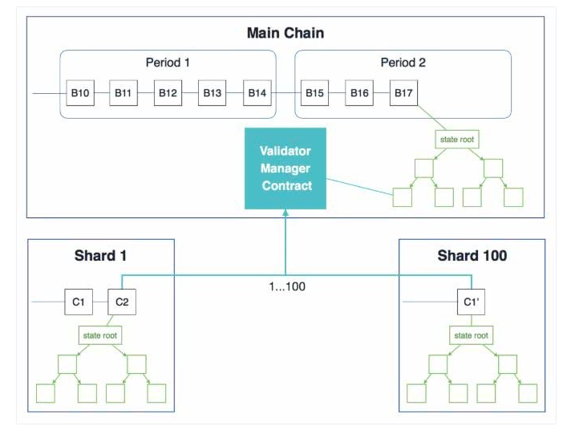

# 分片技术解读

## 分片技术优点

分片技术是一种基于数据库分成若干片段的传统概念扩容技术，它将数据库分割成多个碎片并将这些碎片放置在不同的服务器上。分片技术应用在区块链上是为了解决**吞吐量低**和**可扩展性差**的问题。使用分片技术可以将一条公有链上不同节点和网络上的所有交易都进行分区，每一片区的节点只需要处理和验证其被分配的交易，无需处理所有交易。这样做大大的减少了单个节点的任务量提高了吞吐量。

套用以太坊创始人V神的原话，以太坊2.0的分片就像是创建了一种拥有一百个不同宇宙的区块链，每个宇宙拥有不同的账户空间。但是，这些宇宙空间并不是单独的区块链，它们是共享着共识的互联系统。

## 分片的分类

由于分片机制和对象不同，区块链的分片大致可以分为以下三大类：网络分片（network sharding）、交易分片（transaction sharding）、状态分片（state sharding）。

1. 网络分片

    网络分片的第一个也是最重要的挑战是分片的创建。需要开发一种机制来确定哪些节点以安全的方式驻留在哪个碎片中，以避免有人可能通过对特定碎片的大量节点进行控制的方式对系统进行攻击。击败恶意节点的最佳方法（至少在大多数情况下）是通过随机性。通过利用随机性，网络应该可以随机地对节点进行分配从而形成分片。随机抽样可防止恶意节点过多地填充单个分片。但是，仅使用随机机制将节点分配给分片是不够的。还必须确保分片中的所有成员都是获得系统认后加入的。例如，可以通过工作证明（Proof of Work）来实现对节点身份的验证。

2. 交易分片
   
    如果系统是UTXO模型，最直观的方法是根据交易哈希值的最后几位来决定被分到哪个分片。例如，假设我们有四个分片，哈希值的后两位为00，01，10，11的交易会被分别分配给第一，二，三，四个分片。这样做最大的好处在于交易可以在单个分片中被验证，不需要跨分片通讯。但是，如果用户是恶意的，他可能会使用相同的输入创建两笔不同的交易，从而造成了双重花费（double-spending）。如果两笔交易被分到了不同的分片，那么两个分片都会认为自己手中的交易是有效的，从而造成了双花攻击。为了防止双重花费，在验证过程中，分片必须相互通信。由于双花交易可能落在任何分片中，因此接收交易的碎片必须与每个其他分片都进行通信。这样大规模的跨分片通信开销很可能会破坏交易分片的扩容效果。

    事实上，当我们拥有基于帐户（Account-based）的系统时，问题会很容易解决。每个交易都将具有发件人的地址，然后可以根据发件人的地址将其分配给对应的分片。这确保了造成双花的两笔交易将在同一个分片中得到验证，这样，双重花费可以在没有任何跨分片通信的情况下轻松被发现。
    
3. 状态分片

    状态分片是迄今为止所有分片提案中最具挑战性的。状态分片使每个节点只存储了一部分的区块链状态信息，亦需要类似的机制来维护状态信息，以知道哪个片存储了需要的状态。也就是说每个节点只负责托管自己的分片数据，而不是存储完整的区块链状态。废掉多余的数据，这就不得不面临以下三个问题，即频繁跨分片信息通信（信息共享）、数据的可用性和网络节点调整。

    (1) 跨分片通信和状态交换

    由于每个分片只存储系统的部分状态，分片之间不得不通过大量的通信来获取存储在其他分片中的信息，只有这样才能验证交易是否有效。例如，在一个UTXO模型的区块链系统中，某一笔交易可能有多个输入（input），而这些输入可能存在与其他的分片中，输出分片必须要和所有的输入分片通信确认用户提供的输入是否有效，这会造成大量的通信成本。那么在一个基于账户的系统中也同样需要大量的跨分片通信。所以如何确保跨分片通信成本不会超过状态分片的所获的的性能增益仍然是一个值得深入研究的问题。

    (2) 数据可用性
    
    考虑一种情况，由于某种原因，某个分片可能受到攻击而导致脱机。由于系统的状态没有在所有分片中复制，因此网络一旦有交易的输入是来自脱机的分片，那么这笔交易将无法得到验证。这样，区块链很有可能变得不可用。这个问题的解决方案是维护存档或备份节点，以帮助网络进行故障排除并从数据不可用中恢复。然而，那些节点将必须存储系统的整个状态，因此可能引入集中化风险。

    (3) 网络节点调整
    
    在任何分片机制中都要考虑的另一个挑战（不是特指状态分片）是为了确保分片不是静态的，为了抵御攻击和故障，网络必须接受新节点并以随机方式将它们分配给不同的分片，并且随机驱逐旧的不活跃节点。换句话说，每隔一段时间网络必须重新洗牌。然而，在状态分片的情况下分片的重新配置更加棘手。由于每个分片只维护一部分状态，因此一次性重新洗牌可能会导致整个系统不可用，直到某些同步完成。为了防止中断，必须逐步重新调整网络，以确保在逐出节点之前每个分片都有足够的旧节点。类似地，一旦新节点加入分片，就必须确保节点有足够的时间与分片的状态同步，否则新加入的节点将完全拒绝每一个交易。

## 主流分片项目介绍

|项目|语言|共识算法|交易模型|分片技术特点|是否适用于Dipperin|
|---|----|-------|-------|------|-----|----------------|
|以太坊|Go|Pow->Pos|账户模型|**分为主链和分片链**|适用|
|夸克链|Php|Boson|账户模型|基于“状态分片”|不适用|
|晶砺元|C++|Pow+PBFT|账户模型|**基于“交易分片”**|可借鉴|

1. Ethereum：

    以太坊2.0目前还没有开源，它的分片网络被分为主链和分片链，并同时使用了网络分片，交易分片，状态分片三种分片方式。主链和分片子链的职责分别如下：

    |主链功能|分片链功能|
    |----|-----|
    |生成随机数|处理交易|
    |保存验证者节点信息|存储账户|
    |追踪分片链的区块|存储合约状态|

    为了将分片链加入到主链当中，主链上提供了一种叫做验证人管理员(VMC)的智能合约，该合约是整个分片机制的核心。该合约提供了许多函数接口，主要功能为：权益证明系统，伪随机采样，Collation Header验证，跨分片通信，链上治理等。其中，最主要的两个功能当属**Collation Header验证**和**伪随机采样**。

    VMC通过伪随机采样的方式，选出每个分片上合格的Collator，这部分与Dipperin的密码掷签选取验证者非常的相似。具体地，验证者首先将他们的保障金存入VMC，然后验证代码地址将被记录在VMC内部的全局验证人列表当中。系统会根据验证者存入保障金的多少，按照比例来随机地选择出指定分片内的验证人，这样就使得验证者无法提前预测他们何时会成为哪个分片的验证者，通过增加随机性来提升整个系统的安全性。

    下图表示了每个分片所产生的状态信息要经过VMC的审核验证之后，才能添加到主链区块的状态树。一旦验证人被采样为合格的 collator 来提案一个新的collation，collator 必须对最近的 collation 进行验证，并发送一笔交易来调用addHeader函数。

    该函数由VMC提供，并对提交的Collation header进行校验，一旦校验通过，分片对应的Collation header信息将被添加到主链的Block当中。

    

3. Quarkchain：

    夸克链的分片技术主要基于状态分片， 而状态分片则是每个节点只需要维护它所在的分片的数据，不需要关心其他分片。首先来看看夸克链的共识算法Boson，其主要包含两个部分：第一部分每个分片都运行一个叫根链优先（root-chain-first）的共识算法，分片向根链提交区块头，当出现分叉时，根链比较长的分叉胜出。这样保证攻击分片需要同时攻击主链，增大了攻击难度。第二部分根链会收每个分片的税，通过调整税率可以使得根链上的算力更加集中
    
    夸克链的分片技术分为两个层面，第一层是分片进行交易的预处理。第二层是统一的底层连接去验证所有分片交易。传统的比特币和以太坊就像一个小卖铺，只有一个唯一的入口，一个结账的柜台和一个定向的出口，所以交易进来之后只能按照顺序一个个等待结算。Quarkchain 相当于是建了一个Costco，虽然同时设有10个结账的地方，但出口还是只有一个。归根到底Quarkchain的分片技术节省的只是预处理的时间，所有分片交易在出去之前仍需要排成一个队进行验证，这就不可避免的浪费了大量的验证时间。

4. Zilliqa：

    Zilliqa作为第一个实现分片技术的项目，其整体网络架构就是针对分片技术而设计，有意思的是Zilliqa共识算法和Dipperin非常类似，用的都是PoW+PBFT。所不同的是Zilliqa每确认大约100个区块才需要做一次PoW，而且PoW的目的仅仅是为了确认身份标识减少女巫攻击的可能并进行分片。每个片区的节点数定为600个左右，所以会有600个节点进行PBFT。Zilliqa使用了多重签名技术解决了PBFT通信风暴的问题，对于具有n个节点的网络，传递的消息总数将为n-1。

    Zilliqa是基于”交易分片“，交易分片虽然是多个交易在不同分片并行执行，但是每个节点仍需维护所有分片的完整数据。不过交易分片降低了实现的复杂程度。对于以太坊那种跨分片链交易的问题，Zilliqa可以通过交易分片将同一类型的交易直接映射到同一个分片当中，从而可以通过交易的nonce值避免和检测双花问题。Zilliqa首先通过运行PoW1算法，根据计算排名选举出DS委员会，也就是管理层，用来控制整个分片过程。每隔一段时间内，DS委员会会踢出一个节点，然后把PoW1最快的一个节点加进来。剩余的节点通过运行PoW2算法，先是根据计算排名，选出m个片区的leader，然后会根据提交的PoW哈希值的最后几位和一些随机因素来分配每个节点所在片区，每个片区有n个节点。n一定是大于600的，这样降低了其中有三分之一是恶意节点的概率，保证了安全性。

## 分片技术面临的挑战

分片技术的关键在于由于每个片区里的数据是分开更新的，在设计应用逻辑时必须确保在平衡效率的前提下，对信息进行成功更新，同时也需要预留出一定的鲁棒性来应对一个达成最终一致性过程中可能出现的不一致性。这就无法保证完全的去中心化，所以**高性能和去中心化必须找到一个平衡点**，要牺牲哪一个部分，仍然是困扰分片技术的一个关键难题。此外在区块链中应用分片技术，还需要考虑的问题是对各种攻击如女巫攻击，DDOS攻击、双花攻击的防御。需要在权衡效率的同时，保证每个分片内的总节点数目足够多，并且诚实的节点占大多数，**分片技术对安全性要求极高**。同时，区块链系统中的节点数目比传统数据库中的可能要多，并且面临带宽的限制，和交易出现的跨片问题。需要充分**考虑到延迟带来的不一致性导致的性能和安全性问题**。

## 分片技术应用于Dipperin

对比以上3个项目的分片技术，以太坊的分片技术是比较适用于Dipperin，原因有3点：

1. 符合Dipperin的架构，不管是账户模型，智能合约平台，PoW算法都类似。
2. 核心技术伪随机采样，与Dipperin的密码掷签选取验证者非常的相似，可以复用代码。
3. 主链代码改动较小，但需要新增分片链。

但是以太坊分片技术实现起来相当复杂，因为它同时使用了网络分片、交易分片、状态分片三种分片方式，这部分的代码也还没有开源。其中技术难点包括权益证明系统，Collation Header验证，跨分片通信，链上治理等。

另外，Zilliqa的分片技术非常值得借鉴，它是基于”交易分片“的模式，而且相比以太坊来说代码实现起来也简单的多。Zilliqa的多重签名技术也非常值得深入研究，它解决了困扰Dipperin许久PBFT通信风暴的问题。

## 现有扩容技术分析

区块链里有一个不可能三角：去中心化、安全性、可拓展性无法同时满足。目前区块链基础设施存在可拓展性问题，无法满足大规模应用的需求。在未来，如果Dipperin想要突破TPS的瓶颈，符合高频交易量需求场景，扩容技术一定必不可少的。扩容技术又可分为链上扩容和链下扩容。

### 链上扩容

1. DAG技术

    称为：有向无环图，将原始的链式结构改为网状结构，大幅提升并发性能。像IOTA就是采用DAG技术，并非区块链，也引起了一波热炒，不过现在也还没有实地的技术落地应用出来。安全性和一致性上还未得到充分的验证。

2. 分片技术

    分片技术将全网的工作量分配到各个分片中并行处理，改变网络验证的方式来增加吞吐量。不过分片技术的开发难度大，状态分片需要克服诸多挑战。

### 链下扩容

1. 状态通道

    状态通道是通过在不同用户之间或用户和服务之间建立一个双向通道，为不同实体之间提供状态维护服务。它允许把区块链上的许多操作在链外进行管理，等完成链外操作后多方签名确认后，才将最终结果上链。

    我们用银行和余额宝的例子来讲解一下状态通道，首先我们把银行比作区块链，我们把部分的钱从银行存到余额宝中，用余额宝进行小额交易，当我们想提现时，直接从余额宝提现至银行卡即可。状态通道对应余额宝，当有一方要关闭状态通道时，相当于提现操作，余额宝中保存了当前账户的状态，关闭状态通道时将状态更新至链上，相当于更新银行账户状态。

2. 侧链

    侧链技术是一种分开独立的区块链，其会使用一个双向锚定来依附于主链。你可以将资产移动到侧链上，也可以转移回主链。这种双向锚定可以在主链和侧链之间按照预先设定的速率进行资产的内部交换。初始的区块链通常代表着主链，而且所有新增的区块链都被定义为侧链。

3. 跨链

    跨链就是信息从一条链到另外一条链，区块链之间互通性极大程度的限制了区块链的应用空间。不论对于公有链还是私有链来看，跨链技术就是实现价值互联网的关键，它是把区块链从分散的孤岛中拯救出来的良药，是区块链向外拓展和连接的桥梁。

4. 链下计算

    就是将复杂的任务放到链下处理，再将结果返回链上。以太坊声称要做计算机，EOS 要做全球操作系统，但无论是做计算机还是做操作系统都得正视计算这个问题，链上计算的开销是非常大的，链上每一个 EVM 的 Code 计算需要全球计算机都算一遍，才能得出结果，所以有人做了这么一个计算的扩展，在链外做计算。

### 扩容技术分析总结

Dipperin是基于多链系统的可编程金融公有链，致力于打造一个完善的金融生态，在其生态内，每条链都有其独特的功能，他们之间互不干扰但是随时可以沟通。所以侧链技术必不可少，侧链技术不仅缓解了主链的压力，而且满足了资产兑换和资产转移的需求。侧链技术也有其局限性，那就是必须有一条链Chain A能读懂另一条链Chain B。如果Chain A 和Chain B毫无关系，那么就需要用到跨链技术。跨链技术会在另一篇文章跨链技术分析中详细讲解。

链上扩容技术就目前来看需求程度不高，原因在于链下扩容技术在一定程度上解决了Dipperin的扩容性问题。在现有的链上扩容方案中，虽然分片技术的开发难度大，但是相比于DAG这种未知技术来说门槛较低。

总的来说，按照Dipperin未来的规划路线对这些技术进行需求紧迫性排序：侧链技术>跨链技术>分片技术

## 参考

[1] https://www.jianshu.com/p/9a270f7b048a   
[2] https://www.chainnews.com/articles/045847953970.htm  
[3] https://www.lianyi.com/zixun/978686    
[4] https://blog.zilliqa.com/tagged/chinese    
[5] http://www.elecfans.com/blockchain/931464.html