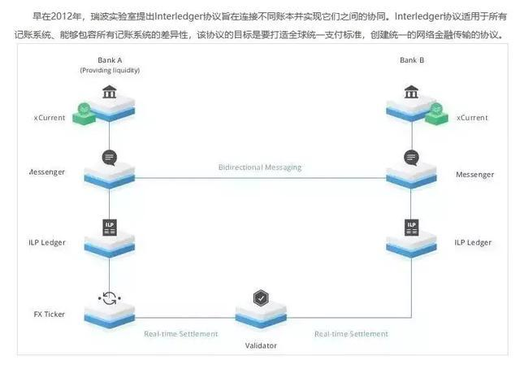
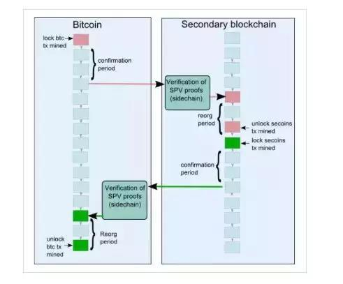
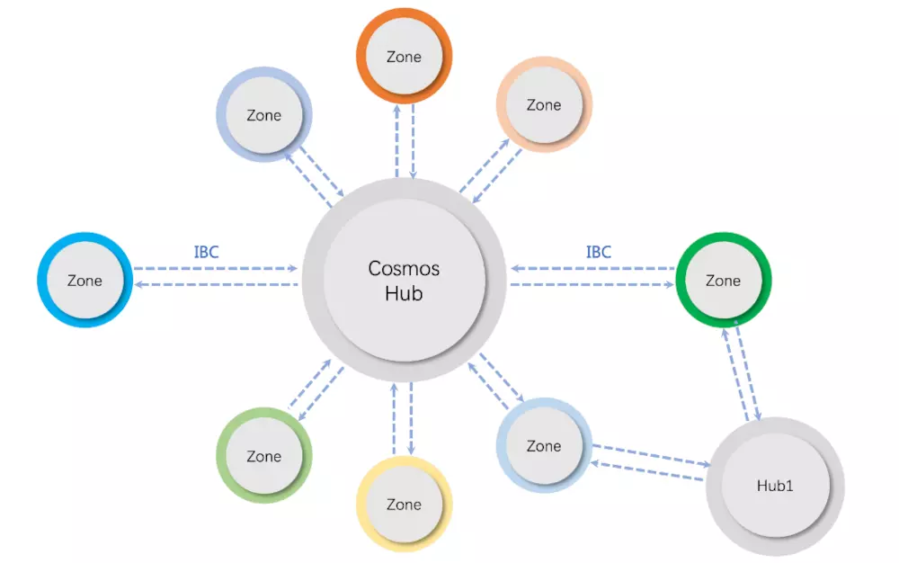
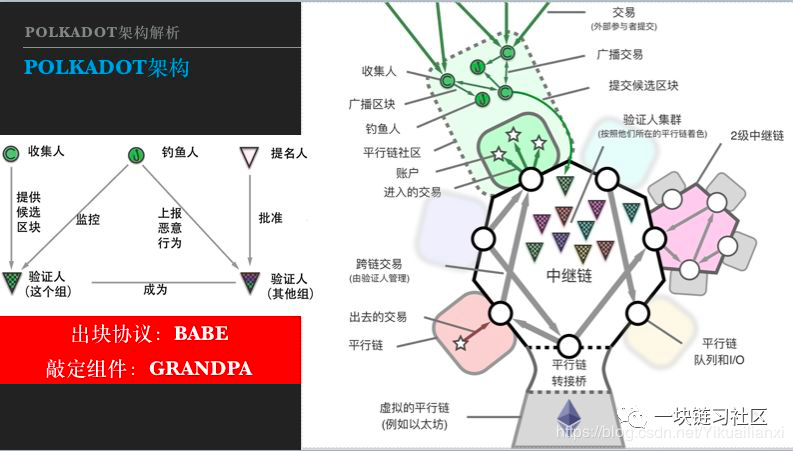
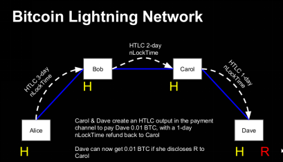

# 跨链技术解读

## 跨链技术优点

跨链技术提高了区块链之间的**互通性**，这将会扩宽区块链的应用空间。不论对于公有链还是私有链来看，跨链技术就是实现价值互联网的关键，它是把区块链从分散的孤岛中拯救出来的良药，是区块链向外拓展和连接的桥梁。

## 主流跨链技术

|技术原理|项目名称|跨链资产转移|多币种智能合约|安全性|交易速度|费率|实现难度|
|-------|-------|----------|------------|-----|------|---|------|
|公证人机制|瑞波Interledger|支持|困难|低|慢|中|中等|
|侧链|RootStock|支持|困难|低|慢|高|困难|
|中继|Polkadot、Cosmos|支持|困难|低|慢|中|困难|
|哈希锁定技术|Lighting network|支持|不支持|中|慢|高|简单|
|公证人+侧链混合技术|EtherUniverse|支持|困难|低|快|低|困难|

### 公证人机制

早在2012年，瑞波实验室提出**Interledger协议**旨在连接不同账本并实现它们之间的协同。Interledger协议适用于所有记账系统、能够包容所有记账系统的差异性，该协议的目标是要打造全球统一支付标准，创建统一的网络金融传输的协议。

Interledger协议使两个不同的记账系统可以通过第三方“连接器”或“验证器”互相自由地传输货币。记账系统无需信任“连接器”，因为该协议采用密码算法用连接器为这两个记账系统创建资金托管，当所有参与方对交易达成共识时，便可相互交易。该协议移除了交易参与者所需的信任，连接器不会丢失或窃取资金，这意味着，这种交易无需得到法律合同的保护和过多的审核，大大降低了门槛。同时，只有参与其中的记账系统才可以跟踪交易，交易的详情可隐藏起来，“验证器”是通过加密算法来运行，因此不会直接看到交易的详情。理论上，该协议可以兼容任何在线记账系统，而银行现有的记账系统只需小小的改变就能使用该协议，从而使银行之间可以无需代理银行就可直接交易。

这是用在在绝大多数跨链项目上的最简单的方式。在公证人机制里，会存在一个或多个受信的实体，这些实体会向A链声明某个事件确实在B链上发生了，或者某个特定的关于B链的声明是真的。优点是简单易实现，而缺点也同样明显，我们需要信任1个或多个实体。

### 侧链

侧链是以锚定某种原链上的代币为基础的新链，正如美金锚定到黄金。侧链是连接各种链，其它区块链则可以独立存在。

关于侧链，首先需要明白一个要点就是：主链并不知道侧链的存在，侧链知道主链的存在。举一个场景，比特币是不可能成为任何公链的侧链的，至少当前的比特币架构是无法做到的。我们用比特币和以太坊为例，以太坊可以成为比特币的侧链，比特币作为以太坊的主链。以太坊能够通过智能合约以及SPV技术知晓比特币的状态，但是比特币做不到去知晓以太坊平台上的状态。如果给一个判定方法，谁是主链，谁是公链，标准是非常简单的：**Chain A能读懂Chain B，则表示A是B的侧链。**

上图是RootStock工作流程示意图。RootStock是一个建立在比特币区块链上的智能合约分布式平台，它的目标是将复杂的智能合约实施为一个侧链，为核心比特币网络增加价值和功能。RootStock实现了以太坊虚拟机的一个改进版本，它将作为比特币的一个侧链，使用了一种可转换为比特币的代币作为智能合约的“燃料”。

RootStock使用了**SPV（Simplified Payment Verification）模式**，它是最初的侧链白皮书《Enabling Blockchain Innovations with Pegged Sidechains》中的**去中心化双向锚定技术**最初设想。SPV是一种用于证明交易存在的方法，通过少量数据就可以验证某个特定区块中交易是否存在。

双向锚定技术是一种将BTC转移到SBTC（智能比特币，这里我们可以理解为就是现在的侧链RSK）的方法，反之亦然。实际上，当BTC被交换成SBTC，区块链之间并没有货币被“转移”。没有任何一笔交易实施了这个动作。 这是因为比特币不能验证另一条区块链上的余额属性。当用户打算把BTC转换成SBTC， 将锁定部分比特币在比特币区块链上，同时在侧链（RSK）上释放等量的SBTC。当SBTC需要换回比特币时，再次在RSK上锁定SBTC，同时在比特币区块链上释放等量的比特币。通过安全协议保证相同的比特币不会在两条区块链上同时释放。

### 中继

中继链本质上算是公证人机制和侧链机制的融合和扩展，目前社区内最活跃的两个跨链项目**Cosmos**，**Polkadot** 采用的都是基于中继链的多链多层架构，其中Cosmos目前支持的是跨链资产交互而Polkadot则宣称提供任意类型的跨链交互，具体实现还有待观察。

1. Cosmos

    Cosmos是Tendermint团队推出的一个支持跨链交互的异构网络，它最终的目标是创建一个区块链互联网，允许大量自主且易开发的区块链互相扩展和交互。Cosmos基于Tendermint开发，采用的Tendermint共识算法，是一个**类似实用拜占庭容错共识引擎**，具有高性能、一致性、具备拜占庭容错等特点。
    
    如下图所示，该网络中主要包括两种角色：Hub和Zone。Zone指的是Cosmos中的平行链，即一条特定区块链。Hub是用于处理所有跨链交互的中继链，它辅助跨链交易的验证和转移，其目的是减少两两跨链的复杂程度。Zone需要具备两个前提条件： 第一个是**快速确定性（fast finality)**，这个特性由共识算法保障，也就是说Cosmos的跨链不直接支持PoW等概率确定模型的区块链；第二个是**强监管性（Sovereignty)**，每个平行链都具有一组验证者能够决定其出块。

    

    为了支持平行链之间的跨链互操作，Cosmos提出了一种**跨链交互协议IBC(Inter-Blockchain Communication protocol)**，并利用tendermint共识算法的即时确定性实现多个异构链之间的价值和数据传输。我们以Chain A 到Chain B 转账10 token为例说明使用IBC的跨链交互： 
    
    (1) 互相跟踪，也就是说如果A要和B进行跨链交易，那么A和B链需要分别运行相当于对方区块链的**轻节点服务**，这样互相可以实时接收到对方的区块头信息（方便后续执行类SPV验证）； 
    
    (2) A链上初始化IBC协议，冻结相关资产10 token, 并生成相应的证明发送给B区块链； 
    
    (3) B链接收到相应的IBC消息，通过A链的区块头信息确定A确实进行相应的资产冻结，然后B链会生成等价值10 token的资产。

    Cosmos为跨链带来的最大贡献在于**IBC协议的设计**，IBC协议提供了一种通用的跨链协议标准。IBC的设计使得跨链交易可以在多个Hub之间进行安全路由和转发，类似目前互联网的TCP/IP 协议。但是遗憾的是目前的Cosmos设计也**只能够支持资产的跨链**，而且由于不同区块链的业务不同其共识速率的不一致也会影响跨链交易有效性的证明。

2. Polkadot

    Polkadot是由原以太坊主要核心开发者推出的公有链。它旨在解决当今两大阻止区块链技术传播和接受的难题：即时拓展性和延伸性。

    Polkadot通过中继链（relay-chain）技术能够将原有链上的代币转入类似**多重签名控制的原链地址**中，对其进行暂时锁定，在中继链上的交易结果将由这些签名人投票决定其是否生效。它还引入了钓鱼人角色对交易进行举报监督。通过Polkadot可以将比特币、以太币等都链接到Polkadot上，从而实现跨链通信。Polkadot目前还是以以太坊为主，实现其与私链的互连，并以其他公有链网络为升级目标，最终让以太坊直接与任何链进行通讯。

    Polkadot的整体架构图下图所示，主要包含三种角色链和四种参与方：

    

    三种链角色：

    (1) 中继链（Relay chain）: 中继链位于Polkadot的体系的核心地位，主要是为整个系统提供统一的共识和安全性保障；

    (2) 平行链（Parachain）: 在Polkadot中平行链负责具体的业务场景，平行链自身不具备区块的共识，它们将共识的职责渡让给了中继链，所有平行链共享来自中继链的安全保障，中继链是Polkadot组成的一部分；

    (3) 桥接链：桥接链指的是非Polkadot体系之外的区块链，如Bitcoin, Ethereum， 这些区块链有自身的共识算法，它们通过不同的Bridge与Polkadot连接在一起进行跨链交互。

    四种参与方：

    (1) 验证者(Validator): 验证者负责Polkadot的网络出块，会运行一个中继链的客户端，在每一轮区块产生中会对其提名的平行链出的块进行核验。当平行链的跨都被他们的子验证者集合确定好之后，验证者们会将所有平行链区块头组装到中继链的区块并进行共识。

    (2) 核验人(Collator): 帮助验证者收集、验证和提交备选平行链区块，维护了一个平行链的全节点。

    (3) 钓鱼人(Fisherman):钓鱼人主要靠检举非法交易或者区块以获取收益；

    (4) 提名人(Nominator): 拥有stake的相关方，维护和负责验证者的安全性。

    Polkadot的特性包括两个，一个是**共享安全性**，一个是**不需信任的跨链交互**。这里的不需信任的跨链交互其实是和第一个特点共享安全性密切相关的，而且Polkadot的不需信任的跨链交互也主要是只其内部的平行链之间。假设parachain A 需要发送一笔交易到parachain B，其过程如下：

    (1) A链将跨链交易放到自己的engress(每个平行链有一个消息输出队列engress 和一个消息输入队列ingress);

    (2) A链的Collator收集A链的普通交易以及跨链交易并提交给A链的验证者集合；

    (3) A链的验证者集合验证成功，将本次A链的区块头信息以及A链的engress内信息提交到中继链上；

    (4) 中继链运行共识算法进行区块确认以及跨链交易路由，中继链上的验证者会将A链的相应交易从A链的engress queue中移动到B链的ingress queue中。
    
    (5) B链执行区块，将ingress queue中相应交易执行并修改自身账本。

    值得一提的是Polkadot项目目前还处在项目初期，对于parachain的设计、Collator的协作以及Validator的共识、工作效率等都未完善。这种共享安全性的方式是否也限制了平行链自身的性能都还有待考证。

### 哈希锁定技术

Lightning network闪电网络提供了一个可扩展的bitcoin微支付通道网络，它极大提升了比特币网络链外的交易处理能力。交易双方若在区块链上预先设有支付通道，就可以多次、高频、双向地实现快速确认的微支付；双方若无直接的点对点支付通道，只要网络中存在一条连通双方的、由多个支付通道构成的支付路径，闪电网络也可以利用这条支付路径实现资金在双方之间的可靠转移。 

闪电网络有两个关键技术，第一个是**HTLC（哈希时间锁合约）**，第二个是**RSMC（到期序列可撤销合约）**。基本原理如下：Alice和Bob可以达成这样一个协议：协议将锁定Alice的0.1 BTC，在时刻T到来之前（T以未来的某个区块链高度表述），如果Bob能够向Alice出示一个适当的R（称为秘密），使得R的哈希值等于事先约定的值H(R)，Bob就能获得这0.1 BTC；如果直到时刻T过去Bob仍然未能提供一个正确的R，这0.1 BTC将自动解冻并归还Alice。

因为有了“**时间限制**”和“**强制执行交易**”的机制，使得交易各方无法在合约签订后私自中断合约交易，从而构建出了一个快捷支付的安全网络。

举个例子，Alice用哈希锁定和时间锁定发送了一笔交易给bob，bob在以太坊用智能合约建立了同样需要哈希锁定和时间锁定才能取钱的交易，假设密码123，哈希锁是a03a 。当alice在以太坊上取钱的时候，bob就会知道密码，从而把比特币上的钱取走。

### 公证人+侧链混合技术

顾名思义，公证人+侧链混合技术就是通过侧链技术实现高效通信，通过公证人机制实现资产跨链的一项创新技术。其优点是支持跨链资产交互和跨链合约和资产抵押，由分布式节点做公众避免中心化的控制，是链与链之间互操作最简单的方法。

以Ether Universe为例，Ether Universe是EOS.IO构建的跨链服务平台。Ether Universe侧链技术实现以太坊网络与EOS网络通信原理如下：首先在Ethereum区块链上实现一个逻辑子链，逻辑子链是主链通过逻辑的方式形成。ETU（ETU为Ether Universe平台的token）通过逻辑子链与其他区块链主链进行双向锚定，实现锁定在内的关联操作，ETU通过EOS的区块链通信功能与EOS主链进行通信交互。

## 跨链技术前景

纵观历史，中国古代闭关锁国，不与外人接触，不学习他国先进的技术，最终导致了清政府签下了不平等条约。区块链也是同样的道理，一条链的作用往往是有限的，跨链技术是实现价值互联网的关键，它是把区块链从分散的孤岛中拯救出来的良药，是区块链向外拓展和连接的桥梁。所以说跨链技术必然是未来区块链的趋势。

目前跨链技术还面临许多困难与挑战：

1. 跨链交易的延迟性问题
    
2. 跨链之间发起的DoS攻击问题

3. 跨链交易中目的链的死循环问题

4. 母链出现分叉的问题

6. 主链和侧链连接处的安全问题

但是，挑战与机遇并存，区块链的发展同时将为云计算和物联网的发展带来更多的想象空间。区块链对数据天然的谨慎和分布式流动，让数据更贴近计算点，让网络更通畅，让计算更及时，对传统的云进行瘦身，从而为云计算装上动力引擎，促进新一代云计算架构的发展；区块链诞生于互联网，却为物联网而生。网络属性是区块链的遗传基因，基于跨链机制，与云计算合体的区块链，通过区块链网络里对数据的加密及共识，解决物联网里数据和价值交换的安全和可信性问题，将进一步推动人类社会迈向万物互联的新时代。

## 跨链技术应用

Dipperin是基于多链生态的可编程金融公链，跨链技术和轻节点技术为此打下了坚实的基础。但是，仅仅做到Dipperin生态中主链和侧链的交互是远远不够的。应当吸取历史的教训，打破“闭关锁国”，学习其他区块链的优点，提高Dippern的流通性。未来，Dipperin还将与外界的区块链交互，例如以太坊，比特币，EOS。

从以上5个跨链技术我们可以发现，公证人机制和哈希锁定技术虽然实现起来比较简单，但是他需要链与链之间有公证人或者跨链渠道，并不通用。侧链技术只能用在Dipperin多链生态中，也不通用。中继技术是非常通用的链与链交互技术，它分为两种模式，其中第一种Polkadot模式实现起来比较复杂，所以Cosmos模式是目前比较好的跨链通用方案，原因有以下两点：

1. 任意两条满足zone条件的链都可以通过IBC协议进行跨链交易

2. Dipperin满足zone的两个条件：快速确定性、强监管性

总结：Dipperin针对不同的场景使用两套跨链方案。如果是在Dipperin多链生态的场景，可以使用公证人+侧链混合技术，这项技术通过侧链技术实现高效通信，通过公证人机制实现资产跨链。如果是打通和外界区块链交互的壁垒，可以使用中继技术中的Cosmos模式，这项技术通过IBC协议使得跨链交易可以在多条链之间进行安全路由和转发。
