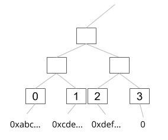
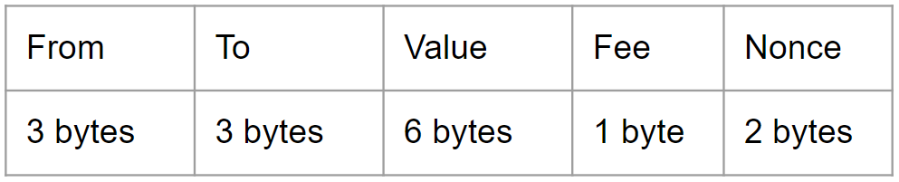
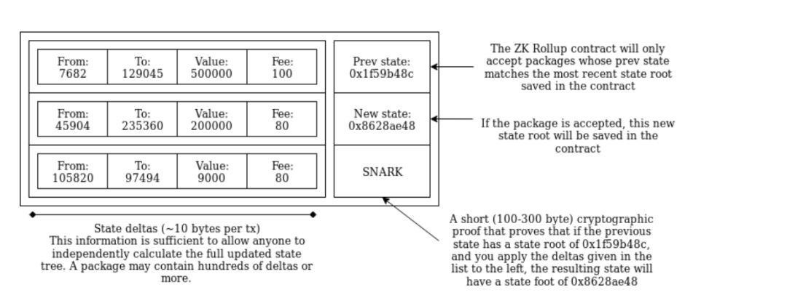
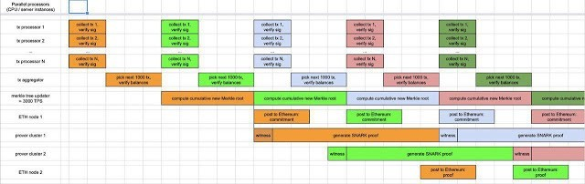

ZK Rollup一开始提出来的时候，是被定义为 layer 2 的解决方案，年初的时候一度以 Plasma Ignis 这个名称作为发表。应该是因为去年 Plasma 很红，一直不断有新的提案跟进展，加上这当时也被定义为 layer 2 的解决方案，这些种种原因，开发者就冠上了 Plasma 的名称，不过因为这项技术跟 Plasma 的精神完全不一样，被社群抗议，后来就恢复到 Rollup 这个名称（开发者的声明），所以搜寻 ‘Plasma Ignis’ 会找不到什么东西。到最近，Rollup 被更名为 semi-layer 2 的解决方案，就是有一点 layer 2 但又没这么layer 2… XD

简单一句话解释 ZK Rollup 就是，数据放在链上的 layer 2 解决方案。

在了解 ZK Rollup之前，先来解释原本 layer 2 有什么问题。以 Plasma 为例，Plasma 链只把 Plasma 区块的 hash 放上 Ethereum 主链上做公正（欲了解Plasma可以参考这里），也就是在链下交易了数百或数千笔的交易，最后上链只有几十个 bytes，这是链下交易的精神，但也是设计上最麻烦的地方——数据的可取得性（编者注：大陆一般译为“数据可用性”）。

就是当有人要离开这个链时，需要一个额外的游戏规则，在 Plasma 叫做挑战期（因为链上没有数据，需要侧链参与者的提供证据），这衍生了有数据才能挑战，所以大家都要存一定数量的数据，相较于跟主链的互动，只需要装一个钱包，并不需要下载区块数据，用户体验上差异很大。挑战期的另一个问题是，使用者需要保持上线状态，不然错过挑战期，就代表默认了交易（因为是采用诈欺证明并非是有效性证明）。简单来说，因为数据的可取得性问题，衍生了

使用者需要常在在线
需下载部分数据
而造成使用者体验很糟（当然现在的 Plasma 设计已经改进了不少）

如何数据放在链上，又不会造成数据过大呢？
首先，先介绍整体架构。跟 Plasma 一样，有一个智能合约做担保，有中继者(relayer)帮忙送交易到智能合约（在 Plasma 叫 operator），中继者除了送交易外，还需要产生 SNARK 证明，一起送上链做验证。

智能合约的部分，可以想象跟 ERC20 一样，在合约里记每个参与者的帐，差别在于，标准的 ERC20 交易是由 Ethereum 这系统做验证，也因此不能合并（因为这就是 Ethereum 的标准交易），而 Rollup 中，是把好几笔交易包成一个标准交易，对 Ethereum 这个系统，就是一个交易，而验证交易的有效性则由智能合约做验证。

实际在智能合约里，用两个 merkle tree 做纪录，一棵树是纪录地址，所以只需要树的索引值就可以代表一个地址（未注册的索引值内容为0），因此地址的数据量就从原本的 20 bytes 减少到只有 3 bytes，另一棵树则记录 balance 跟 nonce。

-地址的默克尔树-
这是数据格式（这是最初的提案，后来的实作交易量更小），

因为用索引值当地址的代表，所以只需要 3 bytes（2²⁴个地址），Value 的部分是以10^-6 当作基底，这样只需要 15 bytes 就可以代表一笔交易，而储存这样一笔交易大约只需要 892 gas（虽然 Value 是 6 bytes，但是文章中的假设大部分的交易只会使用到 4 bytes，所以算法是 13 bytes * 68 + 2 bytes * 4 = 892），而一般 ether 的转移需要21K gas，因此交易速度能提升（所以 Vitalik 的文章标题是 ”On-chain scaling to potentially ~500 tx/sec through mass tx validation”）。

- https://vitalik.ca/general/2019/08/28/hybrid_layer_2.html -
为什么交易速度能提升？也顺便来了解一下交易速度
现今以太坊每个区块的 gas 上限约 8M，所以若单纯 ether 交易，速度约略是

8M / 21K / 15 ~= 25 tps

所以现在的交易瓶颈其实是 gas 的问题，下降交易手续费（编者注：指调低转账所需耗用的 Gas 数量）或是提升区块 gas上限，都能适时纾困（但也会造成衍伸的问题），而 ZK Rollup 就是藉由交易数据量 (size) 的减少，进而能增加交易速度。那来看一下使用ZK Rollup后交易速度能到多快

(8M — 600K (zk-SNARK验证) — 50K（预计合约运行的gas花费）) / 892 / 15 ~= 550 tps

这个数字就是 Vitalik 文章的标头 ”On-chain scaling to potentially ~500 tx/sec”。但实际上并没有这么理想，在作者 Barry 的实作中，大约只有 268 tps，因为每次资产的更新都会留下 event，所以有多余的 gas 花费，然而，这样的设计在应用上也是比较亲切的。

数据都在链上，而且透过 zk-SNARK 做验证，代表着上链的数据都是被验证过的，因此就没有一开始 layer 2 遇到的问题，需要挑战、需要下载数据等等。这也隐含着不需要信任中继者，因为他们无法作坏，最多就是不帮你送交易。

事情没有这么美好…
大家都觉得 zk-SNARK 像个万灵丹一样，用了好像什么事都解决了，不过实际上并没有这么完美。zk-SNARK 除了需要初始设定之外（编者注：指需要信任的初始设置），最大的问题就是需要大量的运算力，在 Barry 提供的数据中，中继者的计算机若是一台 8G 内存加上 20G 的硬盘 swap，大概只能产生 20 tx/sec，远远不及预期的 500tps 或是实作的 200 多 tps。所以这个方案最大的问题在于要怎么解决算力问题。

平行运算！
Matter Lab使用了多中继者模型跟平行运算。多中继者的模型，很像小型的区块链，使用了 DPOS (Delegated Proof of Stake)，还有随机挑选区块产生者，所以被挑选到的区块产生者，就可以收集交易、产生证明并且上链。这样的方法避免了中心化，若中继者被恶意攻击，整个网络还是能运作得下去，另一方面，也为平行运算做了铺路。零知识证明的产生非常花时间，因此基于多中继者模型，Matter Lab提出了 “上链-验证” 两阶段的方式，也就是中继者先把数据上链，下一个阶段再上传证明做验证，进而达到平行运算（如下图）。再加上一些数据的优化，测试结果可达到 1600 tps。

-https://medium.com/matter-labs/introducing-matter-testnet-502fab5a6f17-
延迟…
听似很美好，但是因为你的交易被分两阶段上链，也就是从送出到到被验证，会是好几个区块，时间比原本单纯上链时间会更久。当然，延迟多久是使用者可接受的，这目前也无从得知。这是一个取舍，省了手续费，增加了交易速度，却也增加了时间的延迟，这一切也要等上线后才会知道。

今年初，Vitalik在台北的线下聚会中分享了ZK Rollup的进阶版 — ZK ZK Rollup，有兴趣的人可以参考这篇文章，记录的很详细。

Plasma & Optimistic Rollup
Optimistic Rollup 在设计上跟 Plasma相关，所以只会简单带一下差异。

Karl（注）基于ZK Rollup的设计，在上个月提出 Optimistic Rollup，概念上也是把数据都放链上，但不是用 zk-SNARK 做验证，因为希望能达成更普遍性的应用。而不一样的地方有，把 from 的部分，改为使用者的签章(65 bytes)，因为数据量变大的，可想而知，花的 gas 会更多，交易速度就会不及 ZK Rollup。另一部份是，因为不是用 zk-SNARK 做验证，就需要数据验证的辅助方法（validity game），这边就不详细介绍，有机会再写一篇 Plasma/Optimistic Rollup 的详细介绍。

在估算上，交易速度约是 100 tps，若签章方式改为 BLS，约可提升到450 tps。而在10月的硬分岔后，gas 会下降，预估的交易速度也会分别到达 400/2000 tps。（许愿：希望有人可以介绍一下10月的硬分岔细节 XD）

注：在中文的媒体文章中，都称他是 Casper 的核心研究员之一，但是从我一开始知道这个人，都是在大力宣扬 Plasma，他的部落格、twitter都是跟 Plasma相关的文章，不确定他在 Plasma Group 的角色，但我是把他定位成 Plasma Group 的 leader

文章内容若有错误或是不同观点，欢迎指教

references:
On-chain scaling to potentially ~500 tx/sec through mass tx validation
Introducing Matter Testnet
Optimistic Rollup