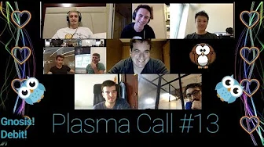
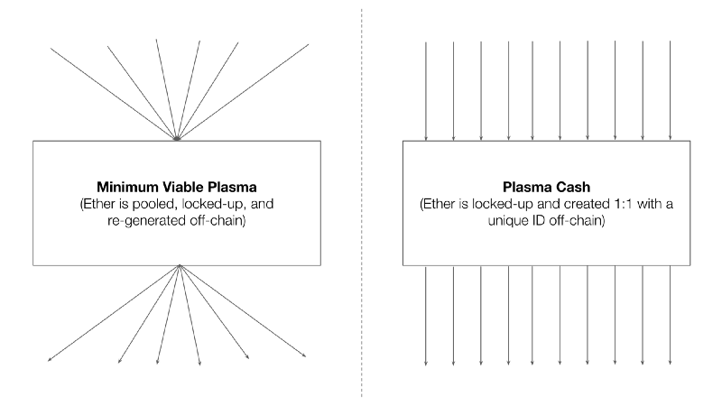
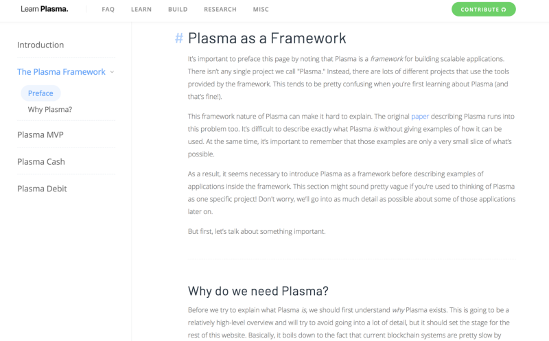

# 以太坊plasma项目调研

为什么关注这个项目？如果所有业务都把数据上链的话，成本会高到让人难以接受，而侧链、分片、多链都是治标不治本的，只有第二层扩展能解决这个问题。以太坊是当前生态最完善的项目，被V神所称赞的项目想必有自己的过人之处，对接以太坊的生态，以后可能也会成为标准。

## Plasma的简介
 
我们经常会谈论到以太坊的第一层（layer 1）和第二层（ layer 2）解决方案。正如Ben在他的文章中谈到的，第一层解决方案被构建到区块链本身的核心基础设施当中。而第二层解决方案（这也是我要讨论的），会建立在区块链顶层，它们不会改变区块链的任何规则。

Plasma是构建于以太坊协议之上的一种二层技术，它结合了智能合约和加密验证技术。总而言之，通过将交易从以太坊主链中脱离出来并进入一个“子”链，从而实现快速而廉价的交易。这些子链会定期汇报给主链，利用主链来解决任何争端（几乎像是高等法院）。主链将使用数学可验证的方法来处理争端，并用自己的资金奖励正确的一方。

关于Plasma的一个基本准则是安全性：你的资金将永远由你来控制，而不是任何其他人（公司或黑客无法窃取你的资金）。Plasma的一些应用包括去中心化的交易所（对等式资产交易所），可使商业生态系统更丰富的快速支付，以及有多对多模型资产转移要求的应用。

Vitalik Buterin最近说，将复杂的特性构建于区块链基础层是一个“坏主意”，他写道：
> “因为平台必须不断面对新发现的技术改进而进行讨论、实现以及协调，这会导致高水平的治理开销，密集地将这些新特性添加到基础协议层，可能会导致以太坊变萧条。我们不应该仅仅依靠基础协议的改变来继续进步，我确实认为，随着区块链变得越来越成熟，基础层网络必然趋于稳定，而第二层（layer 2）网络将承担越来越多的持续创新和改变负担。”

## 进展

Plasma的进展怎么样了？
 
Plasma白皮书［2017年 8月份］
 
Vitalik和Joseph Poon在2017年8月份发布了Plasma白皮书。在白皮书发布的时候，社区的反应有点混乱，但多数人的反应是兴奋的。不久后，OmiseGO项目就宣布将用Plasma来建立一个去中心化的交易所。

p3
 （Plasma实现视频会议，来源：: Youtube）

最小可用Plasma [2018年1月]
 
2018年1月份，Vitalik在Joseph Poon以及David Knott的帮助下，在ethresear.ch上发布了“最小可用plasma”的规范。Plasma MVP的目的是简化Plasma，提供以基本的安全性能，并让开发者快速地开发Plasma。在这个时间点，少数被选定的开发者被邀请加入一个名为“Plasma 实施者的视频会议”。从那开始，Joseph Poon和Karl Floersch每两周会在美国东部时间周三上午10:00开始进行一次视频会议。在这个视频会议里，参与者会讨论新的理论、提议，技术的可行性，或者唱唱生日歌之类的事。

最小可用Plasma [2018年1月]
 
2018年1月份，Vitalik在Joseph Poon以及David Knott的帮助下，在ethresear.ch上发布了“最小可用plasma”的规范。Plasma MVP的目的是简化Plasma，提供以基本的安全性能，并让开发者快速地开发Plasma。在这个时间点，少数被选定的开发者被邀请加入一个名为“Plasma 实施者的视频会议”。从那开始，Joseph Poon和Karl Floersch每两周会在美国东部时间周三上午10:00开始进行一次视频会议。在这个视频会议里，参与者会讨论新的理论、提议，技术的可行性，或者唱唱生日歌之类的事。

Plasma Cash [ 2018年 3月]

2018年3月份，Vitalik、Karl Floersch以及Dan Robinson三人共同发布了Plasma Cash，一般人们在提到Plasma Cash时，都会以“Plasma Cash就是Plasma”这种说法。Plasma Cash之所以会有Cash这个名字，是因为人们认为它的行为类似于现金，也就是说，它无法被分割或切割成不同的值。现在，我们有标准值计价的“纸币”，比如10美元、10美元、50美元以及100美元。而每一份存入到Plasma Cash智能合约的资金，会被视作“钞票”一样变得不可分割。Plasma Cash利用的是唯一的标识符，当你把以太币存入到一个Plasma合约时，该合约允许用户仅存储有关自己的币信息。但即使是这样，从用户的角度来看，存储的需求也可能是过度的，因为需要存储和维持不断增长的交易历史、包含证明以及非包含证明。

Plasma XT [ 2018年 5月份]

2018年5月份，Kelvin Fichter 在Dan Robinson、David Knott、 Joseph Poon、 Karl Floersch、Vitalik Buterin以及Justin Drake这6位大神的帮助下，推出了Plasma XT，这是一种使用密码经济聚合签名（Cryptoeconomic aggregate signatures）和检查点（checkpointing）技术的方案，它可以减少存储需求并保持最终结果。成功的检查点允许用户在检查点之前丢弃既往历史记录，从用户的角度，它显著减少了存储需求，因为检查点是被视为最终的，并且之前的交易无法被逆转或质疑。密码经济聚合签名技术，允许操作者使用位字段在提议的检查点上有效地从用户处获得签名。

（Plasma MVP和Plasma Cash之间的差异化可视图，来源：Kevin Zhang）

 
Plasma Debit和更可行Plasma[ 2018年 6月份]
 
Plasma Cash的一个特性是，它无法被切割或合并。总的来说，这使得Plasma Cash难以成为一种支付转移管理机制。2018年6月份，Dan Robinson在Kelvin Fichter、Vitalik Buterin、Joseph Poon以及Karl Floersch的帮助下，推出了一种称为Plasma Debit的机制，这种机制允许可分割的金额交换。这个机制类似于用借记卡付款，因而以Plasma Debit为名。每一个Plasma Debit币，在当前币的所有者与操作者之间，基本上相当于一个双向支付通道（类似闪电网络的多重签名支付通道）。这允许操作者在任意数量的支付通道中记录微额交易。这种方法目前只适用于运行Plasma链的单操作者。

同样在2018年6月份，Kelvin Fichter 和 Ben Jones，在Vitalik Buterin、Li Xuanji、David Knott、Eva Beylin以及Kasima Tharnpipitchai的帮助下推出了更可行Plasma（More Viable Plasma），和最小可用Plasma一样，它也通常被简称为Plasma MoreVP，它是MVP的一个扩展版本，但是将退出优先级从输入年龄优先级重新组织为最小输入优先级，并删除了确认签名。

目前在ethresear.ch（以太坊研究组织）上面，已经有了100多个关于Plasma的讨论主题，如果你对Plasma解决方案有兴趣，你在那里可以找到很多有用的东西。如果你对这个领域很陌生，但是很想了解关于它的基础知识，learnplasma这个网站会是一个非常好的去处，它是由Kelvin Fichter创建并由社区维护的一个网站。

市场参与者
 
OmiseGO在今年一月初时开始用plasma-mvp进行开发。其通过Plasma技术为他们未来的支付网络构建一个去中心化的交易所。在七月份的一次更新中，他们声称自己已花了一些时间清理存储库，并准备将其转换为‘可用于黑客马拉松’级别的 Plasma MVP”，基本上，这意味着plasma-mvp会被用作一种学习工具。这样做的动机，是让更多的人了解Plasma，从而让更多的开发人员能够在Plasma的基础上快速构建原型和应用。

六月下旬时，Loom Network 发布了他们的Plasma Cash版本，以增强其NFT功能。Plasma Cash对于NFT而言是一个很好的用例，因为它们在Plasma链上提供了唯一的标识符，并且不需要资金的分割操作。Loom已经构建了一个PlasmaChain，其作为一个二层网络中枢，将多个侧链连接至以太坊网络，以允许更快、更便宜的通证交易。你可以在这里找到他们的报告：https://github.com/loomnetwork/plasma-cash

今年7月份，UjoMusic的Simon de la Rouviere写了一篇Plasma入门文章。

## 值得关注的Plasma实现
 
OmiseGO (MVP-Python, Cash-Python):

https://github.com/omisego/plasma-contracts https://github.com/omisego/plasma-mvp 
https://github.com/omisego/plasma-cash

Loom Network (Cash-Python): 
https://github.com/loomnetwork/plasma-cash

BankEX (MVP-JS): 
https://github.com/BANKEX/PlasmaParentContract 
https://github.com/BANKEX/PlasmaETHexchange

Blockchian @ Berekley (MVP-GO): 
https://github.com/FourthState/plasma-mvp-rootchain 
https://github.com/FourthState/plasma-mvp-sidechain

DeepBlockchain (Cash-N/A): 
https://github.com/wolkdb/deepblockchains

Lucidity Tech (Cash-JS): 
https://github.com/luciditytech/lucidity-plasma-cash

## 值的关注的plasma大神
 
- Joseph Poon (Plasma 作者) 
- Vitalik Buterin (Plasma 作者) 
- Karl Floersch (以太坊基金会) 
- David Knott (OmiseGO) 
- Kelvin Fichter (OmiseGO) 
- Dan Robinson (Chain) 
- Xuanji Li (L4 Ventures) 
- Georgios Konstantopoulos (Loom Network)

## 总结
 
Plasma是在不断发展的，它是美丽且令人兴奋的，开发人员可以用多种方式来实现它。Plasma本身不是一种产品，而是一种想法，一种规范，它指导开发人员如何考虑第二层技术，该技术不需要可信操作员来保证用户的资金。很多人可能会问了，“我们什么时候能够真正使用Plasma？”你很难找到能够给你答案的人。很多实现都有很长的路要走，特别是Loom Network和 OmiseGO。我们还有很多工作需要去做，特别是在用户体验方面，因为这些方案中有很多非常依赖于用户的积极参与，这样才能消除欺诈问题。

如果你能从本文中得到一些东西，那就是有很多优秀的开发人员在不断地推动区块链的可扩展性边界，从而提出安全、经济的可用解决方案。我们将会有各种解决方案，但是我们需要有条不紊地去做这些工作，以确保不会危及整个区块链社区。